```{r include=FALSE}
library("knitr")
opts_chunk$set(echo = TRUE, 
                      fig.pos = 'h', 
                      fig.align = 'center', 
                      fig.show='hold')
load("sample.metadata.RData")
```
## Introduction
This document contains the workflow used in the analysis of *T. brucei* gene co-expression network analysis. It contains code used in each step of the analysis.

### Setting up R for the analysis

```{r results='hide', eval=FALSE}
# set working directory
setwd("analysis/")

# ensure results are reproducible
set.seed(1)

# other settings
options(digits = 4)
options(stringsAsFactors = FALSE)

# loading required R packages
library("dupRadar")
library("Rsubread")
library("limma")
library("edgeR")
library("sva")
library("RColorBrewer")
library("ggplot2")
library("gplots")
library("reshape2")
library("ggfortify")
library("xlsx")
library("WGCNA")
library("flashClust")
library("tidyverse")
library("igraph")
library('foreach')
library('doParallel')
library('goseq')
library('Trypanosoma.brucei.TREU927', character.only = TRUE)
library('org.Tb927.tritryp.db')
library('TxDb.TbruceiTREU927.tritryp43.genes')
library('dplyr')
library('rtracklayer')
library('tibble')

# load helper functions
source("~/manuscript-shared-rnaseq/R/enrichment_analysis.R")
source("~/manuscript-shared-rnaseq/R/annotations.R")
source("~/manuscript-shared-rnaseq/R/wgcna.R")
source("~/manuscript-shared-rnaseq/R/util.R")

# set number of threads to allow in WGCNA analysis
allowWGCNAThreads(nThreads=20)
```

## Data acquisition
Data used in this study is obtained from European Nucleotide Archive under accession number SRP002243 and SRR965341.

First, metadata for the data is obtained from EBI as follows:

```{r echo=TRUE, results='hide', eval=FALSE}
#Obtain metadata information for the data used in this study from ENA and SRA databases.

# ENA metadata
# code adapted from: https://wiki.bits.vib.be/index.php/Download_read_information_and_FASTQ_data_from_the_SRA

accession <- "SRP002243" # similarly, obtain data for SRR965341
ena.url <- paste("http://www.ebi.ac.uk/ena/data/warehouse/filereport?accession=",
                 accession,
                 "&result=read_run",
                 "&fields=run_accession,library_name,",
                 "read_count,fastq_ftp,fastq_aspera,",
                 "fastq_galaxy,sra_ftp,sra_aspera,sra_galaxy,",
                 "&download=text",
                 sep="")
ENA.metadata <- read.table(url(ena.url), header=TRUE, sep="\t")

# SRA metadata
SRA.metadata <- read.table("../data/SraRunTable.metadata.txt", header = TRUE, sep = "\t")

# create a text file with urls to fastq files in ENA database
fastq.urls <- ENA.metadata[grepl("fastq_ftp", names(ENA.metadata))]
write.csv(fastq.urls, file="../data/fastq.urls.txt", eol = "\r\n", quote = FALSE, row.names = FALSE)

# obtain sample metadata to be used later in analysis in R.
matches <- c("Run","Library_Name","Sample_Name")
sample.metadata <- SRA.metadata[grepl(paste(matches, collapse="|"), names(SRA.metadata))]

# create grouping factor that will place each sample in the one of three tissues i.e.
# midgut (MG), proventriculus(PV) and salivary glands (SG)
tissue <- factor(c("MG", "MG", "MG", "MG", "MG", "PV", "PV", "SG", "SG", "SG", "SG", 
                   "MG", "MG", "PV", "SG", "SG", "PV"))

# append factor to sample.metadata to group samples
sample.metadata["Tissue"] <- tissue

# The sample below was analysed separately as the reads are paired-end while
# the other samples are single-end.
#
# Add sample from Telleria et al 2014 study (SRR965341) to sample metadata.
sample.metadata$Run <- as.character(sample.metadata$Run)

sample.metadata <- rbind(sample.metadata, "18" = c("SA1", "SRR965341", "SA1", "SG"))

#####################################################################################
# Exclusion of the following samples was done after analysis showed they
# were below required standards

# remove a sample with less than 10M reads from the analysis (SRR039951)
sample.metadata <- sample.metadata[-15,]

# remove 2 samples that have technical duplicates (SRR039937 and SRR039938)
sample.metadata <- sample.metadata[-9,]
sample.metadata <- sample.metadata[-8,]
#####################################################################################

# include batch information for the samples
batch <- factor(c(1, 1, 1, 2, 2, 2, 2, 2, 2, 1, 2, 2, 2, 2, 2))

sample.metadata["Batch"] <- batch
```
  
```{r, eval=TRUE, echo=TRUE}
# print out the sample metadata table
sample.metadata
```


Next, RNASeq data is downloaded from EBI database's FTP site.

```{bash}
cat ../scripts/fastq_download.sh
```

Some of the downstream tools require that FASTQ files that were downloaded in zipped form are unzipped.

```{bash}
cat ../scripts/unzip.sh
```

## Data quality assessment
After downloading the RNASeq data, its quality is checked through the FASTQC tool whose output is a report in HTML format.

```{bash}
cat ../scripts/fastqc_reports.sh
```

Following the high rate of duplicate reads after FASTQC analysis, further analysis is done to ascertain their cause. Duplicate reads are assessed whether they arise from artifacts in PCR (PCR duplicates) or from biological causes (highly expressed genes). This is done later in the analysis after read mapping. Below is the sequence duplication level plot.

See more on duplication [here](https://www.bioinformatics.babraham.ac.uk/projects/fastqc/Help/3%20Analysis%20Modules/8%20Duplicate%20Sequences.html).
```{r echo=FALSE, out.width='80%'}
include_graphics("../figures/fastqc_sequence_duplication_levels_plot.png")
```

## Downloading *T. brucei* and *G. morsitans* genome and annotation files

Genomes are obtained from their respective databases before alignment. The steps to obtain *Glossina morsitans* genome and its annotation file is indicated here as part of documenting the process. It is used in the analysis for reasons stated further in the reads mapping section. The genome and annotation files are downloaded from the TriTrypDB and vectorbase databases as follows:

```{bash, eval=FALSE, engine="sh"}
#Downloading T. brucei genome

wget https://tritrypdb.org/common/downloads/release-43/TbruceiTREU927/fasta/data/TriTrypDB-43_TbruceiTREU927_Genome.fasta \
-P ../data/tbrucei_genome/

#Downloading the GFF file
wget https://tritrypdb.org/common/downloads/release-43/TbruceiTREU927/gff/data/TriTrypDB-43_TbruceiTREU927.gff \
-P ../data/tbrucei_genome_annotations_GFF/

# convert the tbrucei gene annotation from GFF format to GTF (required by some downstream tools)
# uses gffread from cufflinks
mkdir -p ../data/tbrucei_genome_annotations_GTF

gffread ../data/tbrucei_genome_annotations_GFF/TriTrypDB-43_TbruceiTREU927.gff \
-T -o ../data/tbrucei_genome_annotations_GTF/TriTrypDB-43_TbruceiTREU927.gtf

# Download T. brucei annotated transcripts (for use in UTR motif discovery) 
wget https://tritrypdb.org/common/downloads/release-43/TbruceiTREU927/fasta/data/TriTrypDB-43_TbruceiTREU927_AnnotatedTranscripts.fasta \
-P ../data/tbrucei_annotated_transcripts/

# Downloading Glossina genome
wget https://www.vectorbase.org/download/glossina-morsitans-yalescaffoldsgmory1fagz \
-P ../data/glossina_genome_scaffolds/

# Downloading GTF file
wget https://www.vectorbase.org/download/glossina-morsitans-yalebasefeaturesgmory19gtfgz \
-P ../data/glossina_genome_annonations_GTF/

```

## Alignment of reads on the genome (Read Mapping)

The first step is indexing the genome using HISAT2 followed by alignment of the reads. The output is SAM files.

### Indexing the genome

```{bash}
cat ../scripts/hisat2_index.sh
```

### Aligning the reads to the genome

```{bash}
cat ../scripts/hisat2_align.sh
```
Following the high rate of unaligned reads, further analysis is done to ascertain their cause. The reads are aligned to Glossina morsitans genome to determine whether reads from the vector were also present in the sample during sequencing (Dual RNA-Seq). *T. brucei* and *G. morsitans* genome files are concatenated into a single fasta file which is used during the alignment of the reads. This also ensures no cross-mapping of reads take place. 

```{bash, eval=FALSE, engine="sh"}
# make a directory to store the concatenated genomes
 mkdir -p ../data/brucei-morsitans

# copy the genome files to the created directory and concatenate them
cp ../data/glossina_genome_scaffolds/glossina-* ../data/brucei-morsitans/
cp ../data/tbrucei_genome/*.fasta ../data/brucei-morsitans/
cat ../data/brucei-morsitans/*.fa* > ../data/brucei-morsitans/brucei-morsitans_genomes.fasta
```

HISAT2 is used to re-align reads on the *T. brucei* and *G. morsitans* genomes, beginning with indexing the genomes.
Below is the alignment results from HISAT2 alignment tool.
```{r echo=FALSE, out.width='80%'}
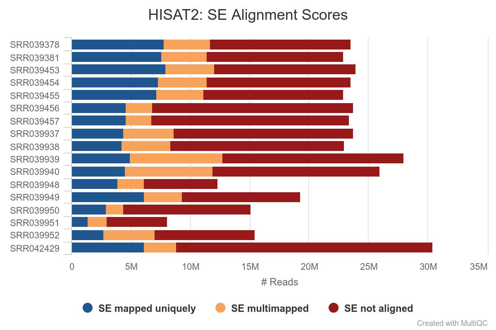
```

## Assessment of the duplication rate
At this point, quality control to assess the duplication rate can be performed.
First, the SAM files are converted to sorted BAM files required by dupRadar tool.

```{bash}
cat ../scripts/sam-to-bam.sh
```

The BAM files are then sorted using samtools

```{bash}
cat ../scripts/sort_bam.sh
```

Next, duplicates are marked in the BAM files using Picard.

```{bash}
cat ../scripts/mark_dupes.sh
```

At this point, dupRadar tool is used to perform quality control in R.
Before this quality control can be performed, we need to verify whether the reads are stranded or not as this is a required parameter for dupRadar as well as HTSeq tool later in the analysis. This can be done using RSeQC package - An RNA-seq Quality Control Package. `infer_experiment.py` module is used in this case. RSeQC documentation and tutorial can be found [here](http://rseqc.sourceforge.net/).

First we convert *T. brucei* genome annotation GTF file into `bed` format required by RSeQC package. Then we use `infer_experiment.py` to verify strandedness using a few samples.

```{bash, eval=FALSE, engine="sh"}
# convert GTF genome annotation to BED format using a custom script from:
#https://github.com/ExpressionAnalysis/ea-utils/tree/master/clipper

../scripts/gtf2bed.pl ../data/tbrucei_genome_annotations_GTF/TriTrypDB-43_TbruceiTREU927.gtf > \
../data/tbrucei_genome_annotations_GTF/TriTrypDB-43_TbruceiTREU927.bed

infer_experiment.py -i ../data/processed_data/bru-mor_bam/SRR039381.bam \
-r ../data/tbrucei_genome_annotations_GTF/TriTrypDB-43_TbruceiTREU927.bed

# output
#This is SingleEnd Data
#Fraction of reads failed to determine: 0.0008
#Fraction of reads explained by "++,--": 0.3832
#Fraction of reads explained by "+-,-+": 0.6161
```

The next step is to run the dupRadar quality control analysis setting the `stranded` parameter as `FALSE` as the reads are not strand specific. Tutorial for the tool can be found [here](https://bioconductor.riken.jp/packages/3.5/bioc/vignettes/dupRadar/inst/doc/dupRadar.html)

```{r eval=FALSE}
# Parameters
bam_file <- "../data/processed_data/bru-mor_bam/SRR039951.dupMarked.bam"
gtf_file <- "../data/brucei-morsitans/brucei-morsitans_annotations.gtf"
stranded <- 0
paired <- FALSE
threads <- 12

# Duplication rate ananlysis
dm <- analyzeDuprates(bam_file, gtf_file, stranded, paired, threads)

#Plots
png(filename = "../figures/duplication_rate/SRR039951.png")
duprateExpDensPlot(DupMat=dm)
title("SRR039951")
dev.off()

# Boxplot
duprateExpBoxplot(DupMat=dm)
```
\newpage
Below are representative plots of samples with PCR duplicates and without PCR duplicates. Samples with PCR duplicates are removed from the analysis before counts data are read into R.

```{r fig.cap="Sample without PCR duplicates", echo=FALSE, out.width='80%'}
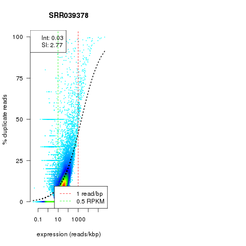
```
\newpage
```{r fig.cap="Sample with PCR duplicates", echo=FALSE, out.width='80%'}
include_graphics("../figures/duplication_rate/SRR039937.png")
```
\newpage
## Reads quantification

HTSeq tool is used to count reads that aligned to the *T. brucei* genome. *T. brucei* annotation file is used and therefore HTSeq excludes counting *G. morsitans* reads that aligned to *Glossina* genome. The output is a text file for each sample that contains the number of reads that were counted for each gene.

```{bash}
cat ../scripts/htseq_counts.sh
```

Below is a graphical visualization of reads assignment by HTSeq.

```{r fig.cap="HTSeq reads assignment", echo=FALSE, out.width='80%'}
include_graphics("../figures/htseq_assignment_plot_brucei_only.png")
```
\newpage
## Generating MultiQC report

MultiQC aggregates results from FASTQC, HISAT2 and HTSeq analysis into an HTML formatted single report for better visualization.

```{bash, eval=FALSE, engine="sh"}
#change directory to results
cd ../results

#Run multiqc
multiqc .

# create a directory for the multiQC report and move the output there.
mkdir -p brucei_multiqc_report
mv multiqc* brucei_multiqc_report/
```

## Filtering out non-protein coding genes
Before loading the data into R, filter out the non-protein coding genes which include ncRNA, snRNA, snoRNA, pseudogenic transcripts, rRNA and tRNA.
```{bash}
cat ../scripts/exclude_features.sh
```


## Analysis in R

### Importing samples count data into R

For further analysis, samples read counts are read into R. To read the sample counts data into R using the script below, simply type `source("../scripts/htseq-combine_all.R")` on the R console and hit enter. Here, ensure the samples to be excluded in the analysis (SRR039951, SRR039937 and SRR039938) are not among the input files.

```{bash}
cat ../scripts/htseq-combine_all.R
```

### Gene IDs and Transcript IDs
```{r eval=FALSE}
# for changing transcript ids to corresponding gene ids
gtf_file <- import("../data/TriTrypDB-43_TbruceiTREU927.gtf")

gene_and_transcript_id <- mcols(gtf_file)[,c("gene_id","transcript_id")]

gene_and_transcript_id <- unique(gene_and_transcript_id)
```

### Sample quality check

The quality of the samples is checked before further analysis to check for outlier and batch effects.

```{r eval=FALSE}
# Remove extra column from sample SRR965341 added while reading data into R
data.all["Var.2"] <- NULL

# Create a DGEList object
counts <- DGEList(data.all, group = sample.metadata$Tissue)

# check the number of genes with no expression in all samples
table(rowSums(counts$counts==0)==15)
#FALSE  TRUE 
# 9184   792
##################################################################
#used the alternative function below instead of this
#
# filter out Non-expressed genes and those with low expression values.
# keep genes with at least 1 read per million in n samples, where n 
# is minimum number of replicates which is 3 in this case
keep <- rowSums(cpm(counts)>1) >= 3

# retain genes above the cpm value
#filtered.counts <- counts[keep, , keep.lib.sizes=FALSE]
##################################################################

# Filtering non-expressed and lowly-expressed genes.
#
# Alternative filtering function that filters better (Law et al 2016)
# retain genes above a calculated cpm value
keep.exprs <- filterByExpr(counts, group=sample.metadata$Sample_Name)
filtered.counts <- counts[keep.exprs,, keep.lib.sizes=FALSE]

# replace transcript ids with gene ids as rownames
filtered.counts.tmp <- tibble::rownames_to_column(as.data.frame(filtered.counts$counts),
                                                  "transcript_id")

filtered.counts.tmp$gene_id <- gene_and_transcript_id$gene_id[match(filtered.counts.tmp$transcript_id,
                                                                    gene_and_transcript_id$transcript_id)]

filtered.counts.tmp <- as.data.frame(filtered.counts.tmp) %>% remove_rownames %>% 
  column_to_rownames(var = "gene_id")

filtered.counts.tmp$transcript_id <- NULL

filtered.counts$counts <- as.matrix(filtered.counts.tmp)

# obtain logCPM unnormalized for plotting purposes.
# Here, the norm.factors value is 1 for all samples
logcpm.unnorm.counts <- cpm(filtered.counts, log = TRUE, prior.count = 2, normalized.lib.sizes = TRUE)

# Normalize for composition bias using TMM
filtered.counts <- calcNormFactors(filtered.counts, method = 'TMM')

# Convert counts per million per gene to log counts per million for further downstream analysis.
logcpm.norm.counts <- cpm(filtered.counts, log = TRUE, prior.count = 2, normalized.lib.sizes = TRUE)

# use ComBat to remove batch effects
modcombat <- model.matrix(~Tissue, data=sample.metadata)
logcpm.norm.counts.combat <- ComBat(dat=logcpm.norm.counts, batch = sample.metadata$Batch, 
                                    mod = modcombat)

```

Various plots are made for the samples before and after normalization.

**Samples heatmap**
```{r results='hide', eval=FALSE, echo=FALSE}
sample_category <- nlevels(sample.metadata$Sample_Name)
colour.palette <- colorRampPalette(brewer.pal(sample_category, "Set2"))(sample_category)
sample.colours <- colour.palette[as.integer(sample.metadata$Sample_Name)]

# Unnormalized sample heatmap
png(filename = "../figures/unnorm_sample_heatmap.png", res =1200, type = "cairo", units = 'in',
    width = 5, height = 4, pointsize = 10)
heatmap.2(cor(logcpm.unnorm.counts), RowSideColors=sample.colours, trace='none', 
          main='Sample correlations', margins = c(8, 8), xlab="Sample", ylab="Sample")
dev.off()

# Normalized sample heatmap
png(filename = "../figures/norm_sample_heatmap.png", res =1200, type = "cairo", units = 'in',
    width = 5, height = 4, pointsize = 10)
heatmap.2(cor(logcpm.norm.counts), RowSideColors=sample.colours, trace='none', 
          main='Sample correlations', margins = c(8, 8), xlab="Sample", ylab="Sample")

dev.off()

# plot to check removal of batch effects by ComBat
png(filename = "../figures/batch_effect_removal_analysis/combat_norm_sample_heatmap.png", res =1200, 
    type = "cairo", 
    units = 'in',
    width = 5, height = 4, pointsize = 10)
heatmap.2(cor(logcpm.norm.counts.combat), RowSideColors=sample.colours, trace='none', 
          main='Sample correlations', margins = c(8, 8), xlab="Sample", ylab="Sample")

dev.off()
```


```{r fig.cap="Filtered-Unnormalized sample correlation heatmap", echo=FALSE, eval=FALSE}
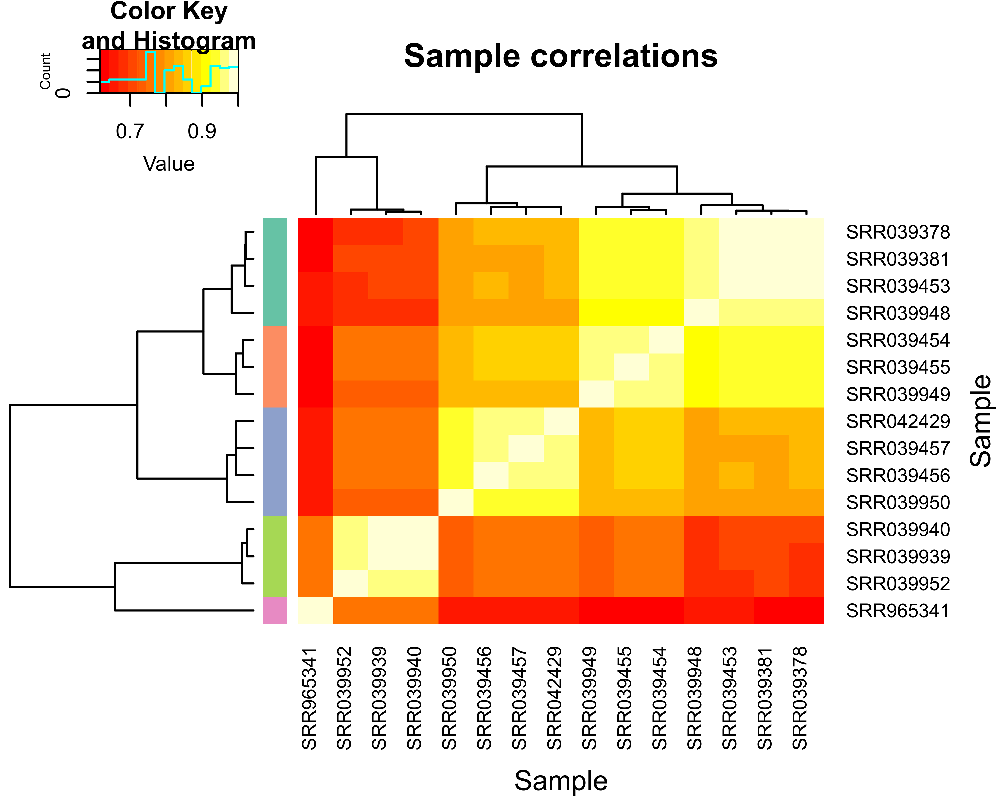
```

```{r fig.cap="Normalized sample correlation heatmap", echo=FALSE}

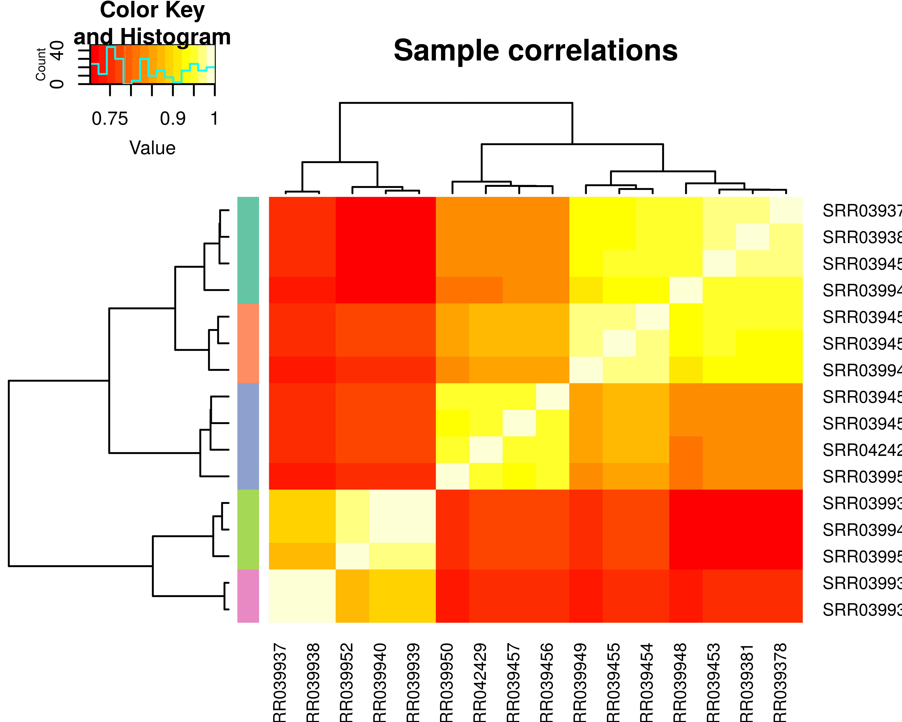
```
\newpage
 **Samples density plot**
```{r eval=FALSE, results='hide', echo=FALSE}
# Checking further using sample density plot

# raw data
log.counts <- log2(counts$counts + 1)
png("../figures/raw_sample_density.png", res =1200, type = "cairo", units = 'in',
   width = 6, height = 6, pointsize = 10)
x <- melt(as.matrix(log.counts))

colnames(x) <- c('gene_id', 'sample', 'log')
ggplot(x, aes(x=log, color=sample)) + geom_density()
dev.off()

# filtered and unnormalized sample data
png("../figures/unnorm_sample_density.png", res =1200, type = "cairo", units = 'in',
    width = 6, height = 4, pointsize = 10)
x <- melt(as.matrix(logcpm.unnorm.counts))

colnames(x) <- c('gene_id', 'sample', 'logcpm')
ggplot(x, aes(x=logcpm, color=sample)) + geom_density()

dev.off()

# filtered and normalized sample data
png("../figures/norm_sample_density.png", res =1200, type = "cairo", units = 'in',
    width = 6, height = 4, pointsize = 10)
x <- melt(as.matrix(logcpm.norm.counts))

colnames(x) <- c('gene_id', 'sample', 'logcpm')
ggplot(x, aes(x=logcpm, color=sample)) + geom_density()

dev.off()
```

```{r fig.cap="Raw sample density plot", echo=FALSE, out.width='90%', eval=FALSE}
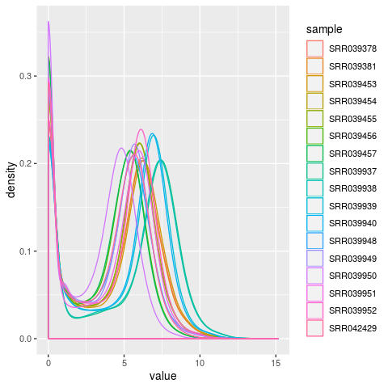
```

```{r fig.cap="Normalized sample density plot", echo=FALSE}

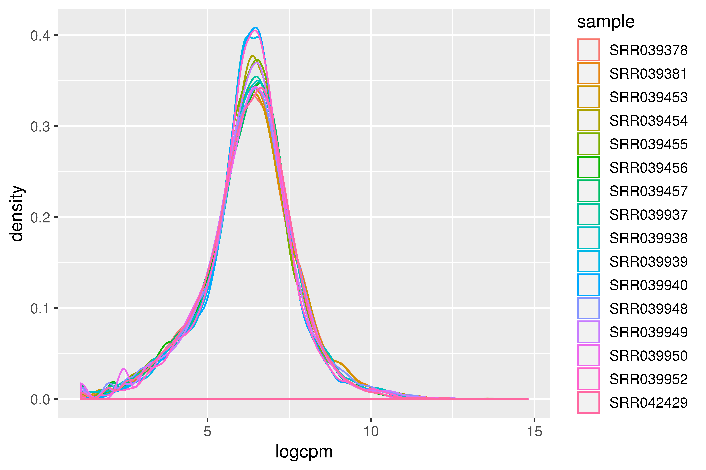
```
\newpage
 **Principal component analysis**
```{r eval=FALSE, results='hide', echo=FALSE}
# PCA

# raw samples PCA
pca.log.counts <- prcomp(t(log.counts)) # raw data (unnormalized and unfiltered)
png(filename = "../figures/raw_samples_PCA.png", res =1200, type = "cairo", units = 'in',
    width = 6, height = 4, pointsize = 10)
autoplot(pca.log.counts,
         data = sample.metadata,
         colour="Sample_Name",
         size=3)
dev.off()

# unnormalized samples PCA
pca.log.counts <- prcomp(t(logcpm.unnorm.counts))  #unnormalized & filtered
png(filename = "../figures/unnorm_sample_PCA.png", res =1200, type = "cairo", units = 'in',
    width = 6, height = 4, pointsize = 10)
autoplot(pca.log.counts,
         data = sample.metadata,
         colour="Sample_Name",
         size=3)
dev.off()


# normalized samples PCA
pca.log.counts <- prcomp(t(logcpm.norm.counts))  #normalized & filtered
png(filename = "../figures/norm_sample_PCA.png", res =1200, type = "cairo", units = 'in',
    width = 6, height = 4, pointsize = 10)
autoplot(pca.log.counts,
         data = sample.metadata,
         colour="Sample_Name",
         size=3)
dev.off()

# plot to check removal of batch effects by ComBat
pca.log.counts.combat <- prcomp(t(logcpm.norm.counts.combat))  #normalized & filtered
png(filename = "../figures/batch_effect_removal_analysis/combat_norm_sample_PCA.png", res =1200, type = "cairo", units = 'in',
    width = 6, height = 4, pointsize = 10)
autoplot(pca.log.counts.combat,
         data = sample.metadata,
         colour="Sample_Name",
         size=3)
dev.off()
```

```{r fig.cap="Raw Sample PCA", echo=FALSE, eval=FALSE}
include_graphics("../figures/raw_samples_PCA.png")
```

```{r fig.cap="Filtered-Unnormalized sample PCA", echo=FALSE, eval=FALSE}

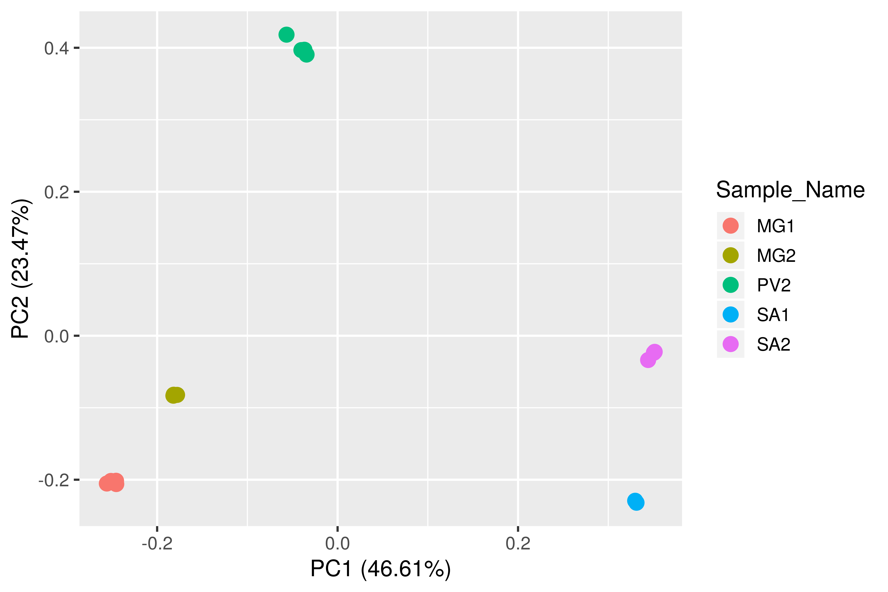
```

```{r fig.cap="Normalized sample PCA", echo=FALSE}

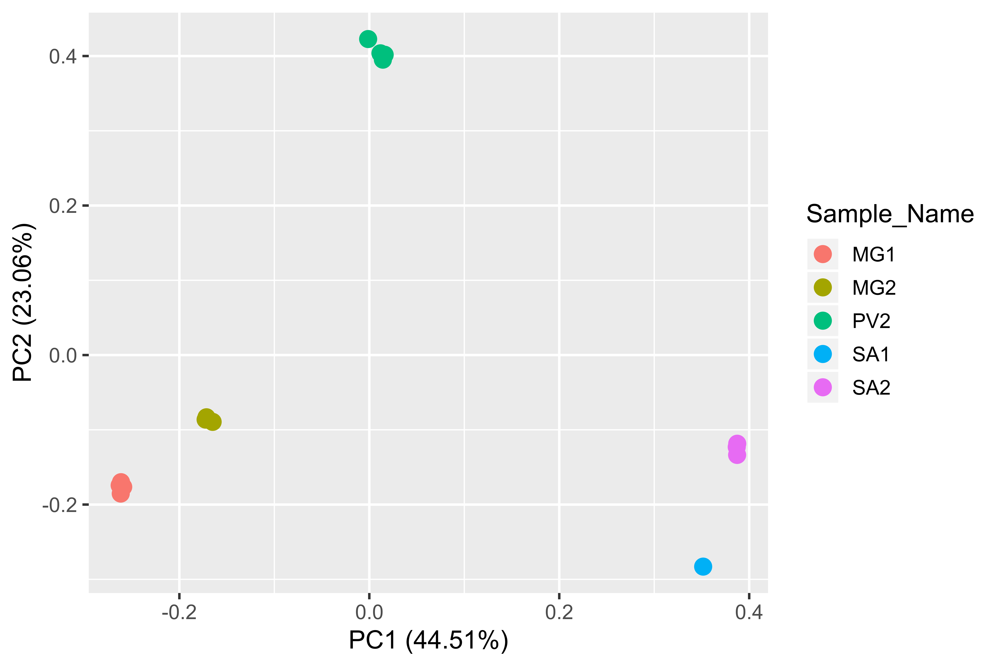
```

```{r fig.cap="Normalized and batch effect removed sample PCA", echo=FALSE}

include_graphics("../figures/batch_effect_removal_analysis/combat_norm_sample_PCA.png")
```

\newpage
 **Boxplot**
```{r, eval=FALSE, echo=FALSE}
# raw sample boxplot
png(filename = "../figures/raw_sample_boxplot.png", res =1200, type = "cairo", units = 'in',
    width = 4, height = 4, pointsize = 6)
y <- melt(as.matrix(log.counts))

colnames(y) <- c('gene_id', 'sample', 'log')
ggplot(y, aes(x=sample, y=log)) + geom_boxplot() + 
  theme(axis.text.x  = element_text(angle=90, vjust=0.5))
dev.off()

# unnormalized sample boxplot
png(filename = "../figures/unnorm_sample_boxplot.png", res =1200, type = "cairo", units = 'in',
    width = 4, height = 4, pointsize = 6)
y <- melt(as.matrix(logcpm.unnorm.counts))

colnames(y) <- c('gene_id', 'sample', 'logcpm')
ggplot(y, aes(x=sample, y=logcpm)) + geom_boxplot() + 
  theme(axis.text.x  = element_text(angle=90, vjust=0.5))
dev.off()

# normalized sample boxplot
png(filename = "../figures/norm_sample_boxplot.png", res =1200, type = "cairo", units = 'in',
    width = 4, height = 4, pointsize = 6)
y <- melt(as.matrix(logcpm.norm.counts))

colnames(y) <- c('gene_id', 'sample', 'logcpm')
ggplot(y, aes(x=sample, y=logcpm)) + geom_boxplot() + 
  theme(axis.text.x  = element_text(angle=90, vjust=0.5))
dev.off()
```

```{r fig.cap="Filtered-Unnormalized Sample boxplot", echo=FALSE, out.width='75%',eval=FALSE}
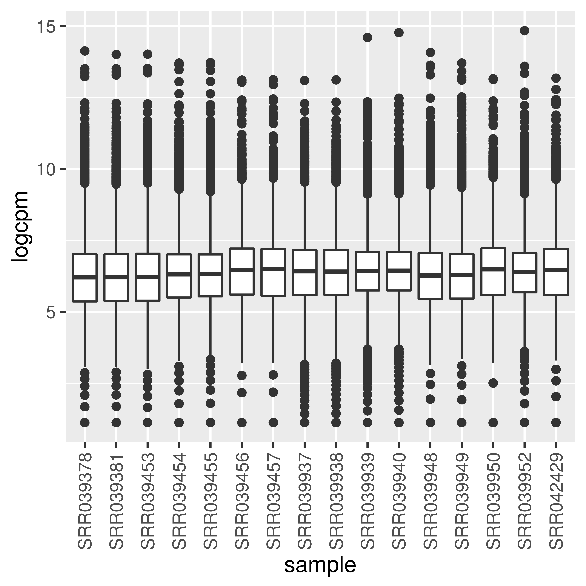
```

```{r fig.cap="Normalized sample boxplot", echo=FALSE, out.width='75%'}


``` 

\newpage
### Identify differentially expressed genes

```{r eval=FALSE}
# Apply sample grouping based on Tissue from which the sample was derived
design <- model.matrix(~0+sample.metadata$Tissue+sample.metadata$Batch)
#colnames(design) <- levels(sample.metadata$Tissue)
colnames(design) <- c("MG","PV","SG","Batch")

# Estimate dispersions for tags
filtered.counts.dge <- estimateDisp(filtered.counts, design, robust = TRUE)

# Fit a generalized likelihood model to the DGELIST using sample grouping
fit <- glmFit(filtered.counts.dge,design)

#################################################################
# code in this section adapted from https://github.com/iscb-dc-rsg/2016-summer-workshop
# generate a list of all possible pairwise contrasts
condition_pairs <- t(combn(levels(sample.metadata$Tissue), 2))

comparisons <- list()
for (i in 1:nrow(condition_pairs)) {
  comparisons[[i]] <- as.character(condition_pairs[i,])
}

# remove MG to SG comparison
comparisons[[2]] <- NULL

# vector to store differentially expressed genes
sig_genes <- c()

# iterate over the contrasts, and perform a differential expression test for
# each pair
for (conds in comparisons) {
    # generate string contrast formula
    contrast_formula <- paste(conds, collapse=' - ')

    contrast_mat <- makeContrasts(contrasts=contrast_formula, levels=design)
    contrast_lrt <- glmLRT(fit, contrast=contrast_mat)
    topGenes <- topTags(contrast_lrt, n=Inf, p.value=0.05, adjust.method = "BH")
    
    # Grab highly ranked genes
    sig_genes <- union(sig_genes, rownames(topGenes$table))
}

# Filter out genes which were not differentially expressed for any contrast
de.genes <- filtered.counts.dge[rownames(filtered.counts.dge) %in% sig_genes,]
dim(de.genes$counts)
#3934   15
################################################################

# Obtain the counts of genes expressed for each contrast individually
# This aims to obtain the number of genes differentially expressed between 
# the 3 stages of development i.e. MG -> PV, PV -> SG

# Likelihood ratio test to identify DEGs
# SG compared to PV
  SG_vs_PV_lrt <- glmLRT(fit, contrast=c(0,-1,1,0))

# PV compared to MG
PV_vs_MG_lrt <- glmLRT(fit, contrast = c(-1,1,0,0))


# Genes with most significant differences (using topTags)
# SG compared to PV
topGenes_SG <- topTags(SG_vs_PV_lrt, adjust.method = "BH", p.value = 0.05, n=Inf)
dim(topGenes_SG)
#3166    5

# PV compared to MG
topGenes_PV <- topTags(PV_vs_MG_lrt, adjust.method = "BH", p.value = 0.05, n=Inf)
dim(topGenes_PV)
#1908    5

#Total number of genes: 5074
#######################################################################################
# DE genes at 5% FDR (using decideTestsDGE function)
#
# SG compared to PV
SG_vs_PV_de.genes <- decideTestsDGE(SG_vs_PV_lrt, adjust.method = "BH", p.value = 0.05)

# get summary
summary(SG_vs_PV_de.genes)
#       -1*PV 1*SG
#Down         1463
#NotSig       4224
#Up           1703

# PV compared to MG
PV_vs_MG_de.genes <- decideTestsDGE(PV_vs_MG_lrt, adjust.method = "BH", p.value = 0.05)

# summary
summary(PV_vs_MG_de.genes)
#       -1*MG 1*PV
#Down         987
#NotSig       5482
#Up           921

# DE genes in the PV that are common in both comparisons
de.common <- which(PV_vs_MG_de.genes[,1]!=0 & SG_vs_PV_de.genes[,1]!=0)
length(de.common)
#1140 

de.common.df <- as.data.frame(de.common)
de.common.df <- tibble::rownames_to_column(de.common.df, var = "gene_id")

# create a dataframe with data on PV and SG differential gene expression
PV_data <- topGenes_PV$table
SG_data <- topGenes_SG$table

PV_data <- tibble::rownames_to_column(PV_data, var = "gene_id")
SG_data <- tibble::rownames_to_column(SG_data, var = "gene_id")

# obtain the common genes for each comparison
PV_data_common_de_genes <- PV_data %>% filter(gene_id %in% de.common.df$gene_id)
SG_data_common_de_genes <- SG_data %>% filter(gene_id %in% de.common.df$gene_id)

PV_data_common_de_genes <- PV_data_common_de_genes[order(PV_data_common_de_genes$logFC, 
                                                         decreasing = TRUE),]
SG_data_common_de_genes <- SG_data_common_de_genes[order(SG_data_common_de_genes$logFC, 
                                                         decreasing = TRUE),]

# write out to excel upregulated and downregulated genes and the commmon genes between contrasts
PV_vs_MG <- PV_data[order(PV_data$logFC, decreasing = TRUE),]
SG_vs_PV <- SG_data[order(SG_data$logFC, decreasing = TRUE),]

write.xlsx(PV_vs_MG, file = "../results/differentially_expressed_genes.xlsx",
           sheetName = "MG vs PV", row.names = FALSE)
write.xlsx(SG_vs_PV, file = "../results/differentially_expressed_genes.xlsx",
           sheetName = "PV vs SG", append = TRUE, row.names = FALSE)

write.xlsx(PV_data_common_de_genes, 
           file = "../results/differentially_expressed_genes_common_in_contrasts.xlsx",
           sheetName = "MG vs PV Common genes", append = TRUE, row.names = FALSE)
write.xlsx(SG_data_common_de_genes, 
           file = "../results/differentially_expressed_genes_common_in_contrasts.xlsx",
           sheetName = "PV vs SG Common genes", append = TRUE, row.names = FALSE)

PV_contrast_common_de_genes_logFC <- PV_data_common_de_genes %>% select(gene_id, logFC_MGvsPV=logFC)

SG_contrast_common_de_genes_logFC <- SG_data_common_de_genes %>% select(gene_id, logFC_PVvsSG=logFC)

contrast_common_de_genes_logFC <- merge(PV_contrast_common_de_genes_logFC, 
                                        SG_contrast_common_de_genes_logFC, by="gene_id")

write.xlsx(contrast_common_de_genes_logFC, 
           file = "../results/differentially_expressed_genes_common_in_contrasts_logFC_comparison.xlsx",
           sheetName = "Common DEGs LogFC Comparisons", row.names = FALSE)

```

Plotting to visually inspect differential gene expression results.

```{r, eval=FALSE, echo=FALSE}
# Differential expression analysis - plots
#
# Volcano plots
SG_DEGs <- topGenes_SG$table

SG_DEGs <- tibble::rownames_to_column(SG_DEGs, var = "gene_id")

SG_DEGs = mutate(SG_DEGs, sig=ifelse(SG_DEGs$FDR <0.05 & abs(logFC)>1, "FDR<0.05", "Not Sig"))

#png("../figures/ggplot_SG-PV_DEG_volcanoplot.png", res =1200, type = "cairo", units = 'in',
#    width = 6, height = 6, pointsize = 4)
ggplot(SG_DEGs, 
  aes(logFC, -log10(PValue))) +
  geom_point(aes(col=sig),size = 1) + 
  theme_bw(base_size = 9) + 
    #coord_cartesian(ylim=c(0,300))+ 
  coord_cartesian(xlim=c(-10,13)) +
  scale_color_manual(values=c("red","black")) +
  ggtitle("SG vs PV differentilaly expressed genes") +
  geom_text_repel(data=filter(SG_DEGs, abs(logFC)>5),
                  #family = "Times New Roman", 
                  aes(label=gene_id),
                  #size = 2, 
                  arrow = arrow(length = unit(0.01, 'npc')), 
                  force = 7,box.padding = unit(0.4, "lines"), 
                  point.padding = unit(0.3, "lines"))
ggsave("SG-PV_DEG_volcanoplot.png", device = "png")

#dev.off()
###################################
PV_DEGs <- topGenes_PV$table

PV_DEGs <- tibble::rownames_to_column(PV_DEGs, var = "gene_id")

PV_DEGs = mutate(PV_DEGs, sig=ifelse(PV_DEGs$FDR <0.05 & abs(logFC)>1, "FDR<0.05", "Not Sig"))

ggplot(PV_DEGs, 
       aes(logFC, -log10(PValue))) +
  geom_point(aes(col=sig),size = 1) + 
  theme_bw(base_size = 9) + 
  #coord_cartesian(ylim=c(0,300))+ 
  coord_cartesian(xlim=c(-12,7)) +
  scale_color_manual(values=c("red","black")) +
  ggtitle("PV vs MG differentilaly expressed genes") +
  geom_text_repel(data=filter(PV_DEGs, abs(logFC)>3.5),
                  #family = "Times New Roman", 
                  aes(label=gene_id),
                  #size = 2, 
                  arrow = arrow(length = unit(0.01, 'npc')), 
                  force = 7,box.padding = unit(0.4, "lines"), 
                  point.padding = unit(0.3, "lines"))
ggsave("PV-MG_DEG_volcanoplot.png", device = "png")

#####################################
# create a venn diagram to show distribution of the number DEGs between stages
PV_data_tmp <- PV_data %>% tibble::column_to_rownames("gene_id")
SG_data_tmp <- SG_data %>% tibble::column_to_rownames("gene_id")

png(filename = "../figures/venn_de_genes.png", res =1200, type = "cairo", units = 'in',
    width = 5, height = 4, pointsize = 10)
vd <- venn.diagram(x = list("MG vs PV" = rownames(PV_data_tmp),
                            "SG vs PV" = rownames(SG_data_tmp)),
                   fill = brewer.pal(3, "Set2")[1:2], filename = NULL)
grid.draw(vd)
dev.off()

# clean up
rm(PV_data_tmp, SG_data_tmp)
```

```{r, fig.cap="Venn diagram showing differentially expressed genes", echo=FALSE, out.width='75%'}
# venn diagram
include_graphics("../figures/venn_de_genes.png")
```
\newpage
```{r, fig.cap="Differentially expressed genes in the proventriculus compared to midgut", echo=FALSE, out.width='75%'}
# Genes differentially expressed in proventriculus compared to midgut (above p<0.05)
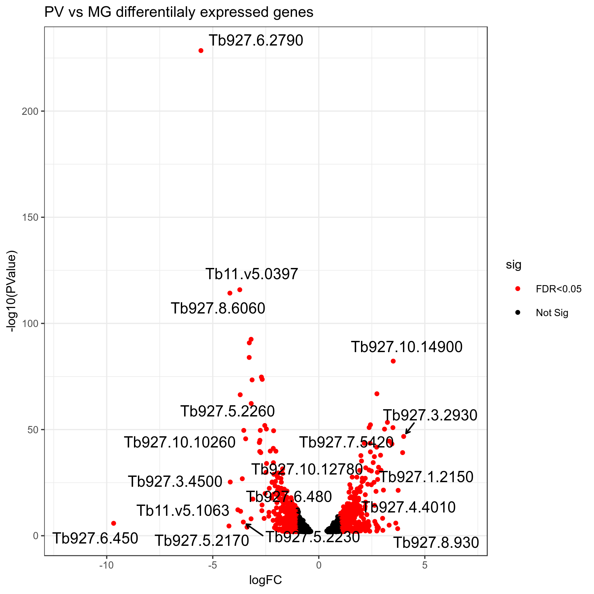
```

```{r, fig.cap="Differentially expressed genes in the salivary gland compared to proventriculus", echo=FALSE, out.width='75%'}
# Genes differentially expressed in salivary gland compared to proventriculus (above p<0.05)
include_graphics("../figures/SG-PV_DEG_volcanoplot.png")
```
\newpage
### Weighted gene co-expression analysis
```{r, eval=FALSE}

# obtain the required counts data (WGCNA input)
# WGCNA requires genes to be in columns
network.counts <- t(logcpm.norm.counts.combat)

# determine the soft-thresholding power to use
powers <- c(c(1:10), seq(from = 12, to=20, by=2))
sft <- pickSoftThreshold(network.counts, powerVector = powers, verbose = 5)

```
\newpage
Plots to determine the soft thresholding power to use.
```{r, eval=FALSE, echo=FALSE}
# Scale-free topology fit index as a function of the soft-thresholding power
png(filename = "../figures/soft-thresholding_power.png", res =1200, type = "cairo", units = 'in',
    width = 4, height = 4, pointsize = 10)
plot(sft$fitIndices[,1], -sign(sft$fitIndices[,3])*sft$fitIndices[,2], 
     xlab="Soft Threshold (power)", 
     ylab="Scale Free Topology Model Fit,signed R^2",type="n", 
     main = paste("Scale independence"));
text(sft$fitIndices[,1], -sign(sft$fitIndices[,3])*sft$fitIndices[,2],
     labels=powers,cex=cex1,col="red");

# The red line corresponds to using an R^2 cut-off of h
abline(h=0.80,col="red")
dev.off()

# Mean connectivity as a function of the soft-thresholding power
png(filename = "../figures/mean_connectivity.png", res =1200, type = "cairo", units = 'in',
    width = 4, height = 5, pointsize = 10)
plot(sft$fitIndices[,1], sft$fitIndices[,5], 
     xlab="Soft Threshold (power)", 
     ylab="Mean Connectivity", type="n", 
     main = paste("Mean connectivity"))
text(sft$fitIndices[,1], sft$fitIndices[,5], labels=powers, cex=cex1,col="red")
dev.off()
```

```{r echo=FALSE, out.width='80%'}

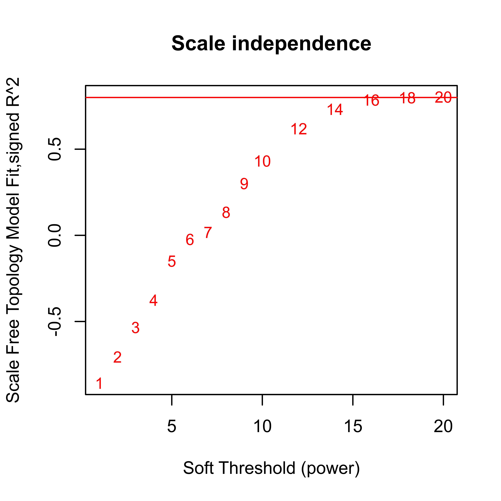
```

```{r echo=FALSE, out.width='80%'}

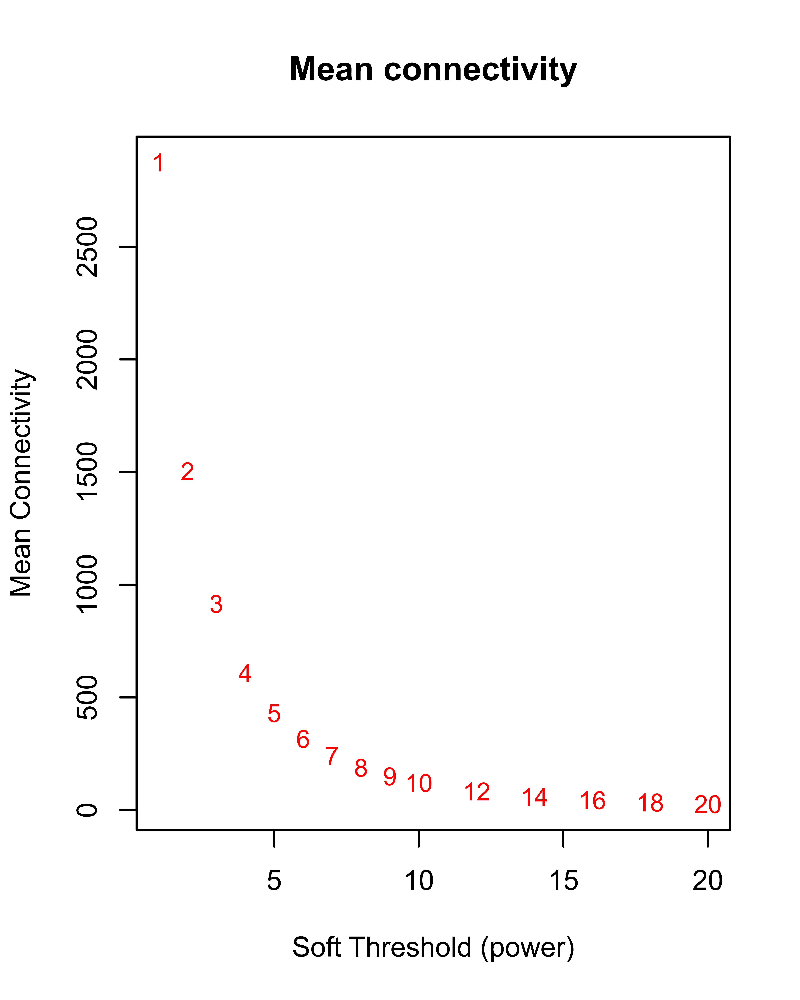
```

```{r, eval=FALSE}
########################################################################
## Constructing the network
########################################################################

# construct adjacency matrix
softpower <- 14
adjacency.matrix <- adjacency(network.counts, power=softpower,
                                             type = "signed", corFnc = "cor")

# Turn the adjacency matrix to topologicaal overlap matrix to minimize
# the effects of noise and spurious associations
TOM <- TOMsimilarity(adjacency.matrix, TOMType = "signed")
dissTOM <- 1 - TOM

#set diagonal to NA to remove uninformative correlations
diag(adjacency.matrix) <- NA


# Adjacency matrix heatmap plot / network heatmap of selected genes
heatmap_indices <- sample(nrow(adjacency.matrix), 500) # sub-sample for visualization purposes

png(filename = "../figures/adjacency_matrix_heatmap.png", res =1200, type = "cairo", units = 'in',
    width = 5, height = 5, pointsize = 10)
heatmap.2(t(adjacency.matrix[heatmap_indices, heatmap_indices]),
            col=redgreen(75),
            labRow=NA, labCol=NA, 
            trace='none', dendrogram='row',
            xlab='Gene', ylab='Gene',
            main='Adjacency matrix',
            density.info='none', revC=TRUE)
dev.off()


# remove adjacency matrix and TOM to free up memory
rm(adjacency.matrix)
gc()
```

```{r fig.cap="Adjacency matrix heatmap (500 genes)", echo=FALSE, out.width='80%'}

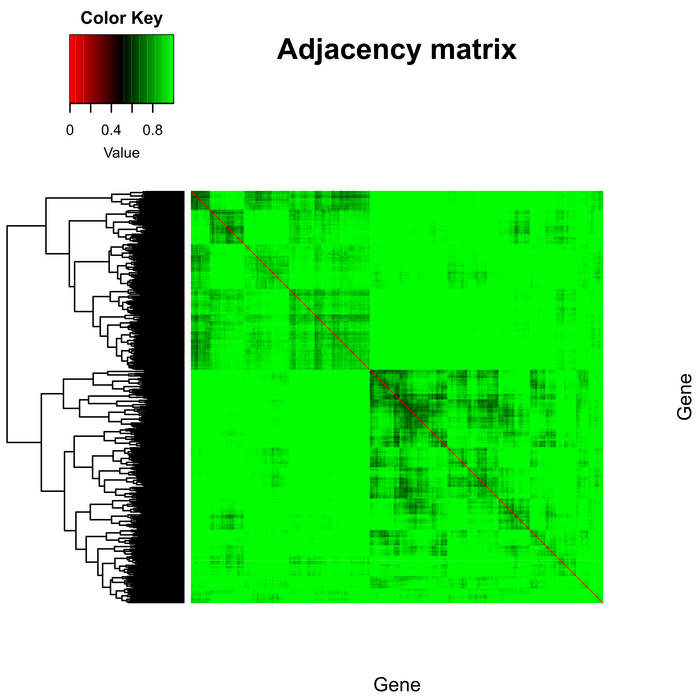
```
\newpage
```{r, eval=FALSE}
################################################################
## Detecting co-expression modules in R
################################################################

# view the dendrogram based on hierachical clustering of genes
gene.tree <- flashClust(as.dist(dissTOM), method = "average")

# plot the gene tree
png(filename = "../figures/gene_tree.png", res =1200, type = "cairo", units = 'in',
    width = 7, height = 8, pointsize = 10)
#sizeGrWindow(12,9) #open graphical window
plot(gene.tree, xlab="", sub="", main = "Gene clustering based on TOM dissimilarity", 
     labels = FALSE, hang = 0.04)
dev.off()

# identify the modules
module.labels <- cutreeDynamicTree(gene.tree, deepSplit = FALSE, 
                                   minModuleSize = 30)

#view
table(module.labels)

# convert labels to colours
module.colours <- labels2colors(module.labels)

# view
table(module.colours)

# a list of 27 modules

        black          blue         brown          cyan     darkgreen 
          438           614           547           219           102 
     darkgrey    darkorange       darkred darkturquoise         green 
           93            80           106           100           528 
  greenyellow          grey        grey60     lightcyan    lightgreen 
          251            59           191           193           164 
  lightyellow       magenta  midnightblue        orange          pink 
          129           264           200            86           383 
       purple           red     royalblue        salmon           tan 
          251           460           127           230           243 
    turquoise         white        yellow 
          732            61           539 

# visualize the gene tree and TOM matrix together using TOM plot
# if necessary, raise dissTOM to a power to make moderately strong connection more visible in heatmap
diag(dissTOM) <- NA

png(filename = "../figures/gene_tree_and_dissTOM.png", res =1200, type = "cairo", units = 'in',
    width = 5, height = 6, pointsize = 10)
TOMplot(dissTOM, gene.tree, as.character(module.colours))
dev.off()

# remove matrix to free memory
rm(dissTOM)
gc()


# plot gene dendrogram
png(filename = "../figures/gene_tree_and_colours.png", res =1200, type = "cairo", units = 'in',
    width = 6, height = 6, pointsize = 10)
#sizeGrWindow(8,6) #open graphical window
plotDendroAndColors(gene.tree, module.colours, "Dynamic Tree Cut", dendroLabels = FALSE,
                    hang = 0.03, addGuide = TRUE, guideHang = 0.05,
                    main = "Gene dendrogram and module colours")
dev.off()

# get hub genes
# choose power 4: https://support.bioconductor.org/p/46342/
module.hub.genes <- chooseTopHubInEachModule(network.counts, module.colours, 
                                             power = 4,type = "signed")

# A list of module hub genes
           black             blue            brown             cyan 
  "Tb927.7.1790"   "Tb927.8.3620"  "Tb927.11.1570"   "Tb927.2.5530" 
       darkgreen         darkgrey       darkorange          darkred 
"Tb927.11.14020"   "Tb927.9.9450"    "Tb927.8.710"   "Tb927.2.5270" 
   darkturquoise            green      greenyellow           grey60 
  "Tb927.8.6650" "Tb927.10.13790"    "Tb927.7.920"  "Tb927.10.3820" 
       lightcyan       lightgreen      lightyellow          magenta 
 "Tb927.11.6440"   "Tb927.10.720"  "Tb927.10.2560"   "Tb927.9.6290" 
    midnightblue           orange             pink           purple 
 "Tb927.11.6640"   "Tb927.9.2520"  "Tb927.10.6200"    "Tb927.1.600" 
             red        royalblue           salmon              tan 
  "Tb927.7.6920" "Tb927.10.15680"  "Tb927.11.1450"   "Tb927.3.2930" 
       turquoise            white           yellow 
 "Tb927.9.15630"   "Tb927.8.7980"   "Tb927.1.3550"

```

\newpage
```{r fig.cap="Gene tree and module colours", echo=FALSE, out.width='80%'}

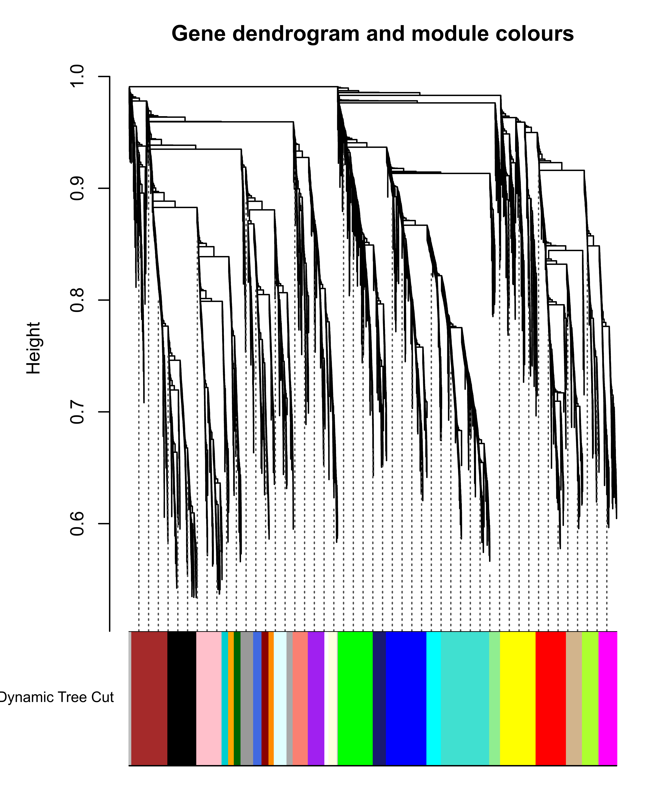
```


```{r, eval=FALSE, echo=FALSE}
#The section below is included for further checks so it may not be necessary to carry out this analysis.

# --------------------------------------------------------------------------------------------
# merge modules with very similar expression profiles as their genes are highly co-expressed
# get the module eigengenes
module.eigengenes <- moduleEigengenes(network.counts, colors = module.colours)$eigengenes

# calculate dissimilarity of module eigengenes using correlations
module.eigengenes.diss <- 1 - cor(module.eigengenes)

# cluster module eigengenes
module.eigengenes.tree <- flashClust(as.dist(module.eigengenes.diss), method = "average")

# choose height at which to cut the tree for merge i.e. the threshold
module.eigengenes.thresh <- 0.25

# create plots for the results
png(filename = "../figures/module_eigengenes_cluster.png", res =1200, type = "cairo", units = 'in',
    width = 5, height = 6, pointsize = 10)
#sizeGrWindow(7, 6)
plot(module.eigengenes.tree, main = "Clustering of module eigengenes", xlab = "", sub = "")
abline(h=module.eigengenes.thresh, col="red")

dev.off()

# merge the modules
module.eigengenes.merge <- mergeCloseModules(network.counts, module.colours, 
                                             cutHeight = module.eigengenes.thresh)

# merged module colours
merged.module.colours <- module.eigengenes.merge$colors

# view
table(merged.module.colours)

# a list of 13 modules

      black        blue       brown    darkgrey     darkred       green 
        438        1565         735         477         796         728 
greenyellow        grey  lightgreen         red      salmon       white 
        515          59         164         703         230         441 
     yellow 
        539

# eigengenes of new merged modules
merged.module.eigengenes <- module.eigengenes.merge$newMEs

```

```{r, eval=FALSE, echo=FALSE}

# plot the dendrogram with original and merged colours underneath
#sizeGrWindow(12, 9)
png(filename = "../figures/merged-original_colours-original_dendro.png", res =1200, type = "cairo", 
    units = 'in', width = 6, height = 6, pointsize = 10)
plotDendroAndColors(gene.tree, cbind(module.colours, merged.module.colours), 
                    c("Dynamic Tree Cut", "Merged dynamic"), 
                    dendroLabels = FALSE, hang = 0.03, addGuide = TRUE, guideHang = 0.05)
dev.off()

# plot heatmap of eigengenes (orginal before merge)
png(filename = "../figures/eigengenes_heatmap.png", res =1200, type = "cairo", units = 'in',
    width = 5, height = 6, pointsize = 10)
plotEigengeneNetworks(module.eigengenes, "Eigengenes heatmap", marHeatmap = c(3,4,2,2),
                      plotDendrograms = FALSE, xLabelsAngle = 90)
dev.off()
```


```{r fig.cap="Dendrogram with original and merged colours", echo=FALSE, out.width='80%', eval=FALSE}

include_graphics("../figures/merged-original_colours-original_dendro.png")
```

```{r, eval=FALSE, echo=FALSE}

#-----------------------------------------------------------------------------------------
# rename some variables based on the module eigengene analysis for later use
#
# module colours
#module.colours <- merged.module.colours

# construct numerical labels corresponding to the colours
colorOrder <- c("grey", standardColors(50))
#module.labels <- match(module.colours, colorOrder)-1

# module eigengenes
#module.eigengenes <- merged.module.eigengenes

# get hub genes
merged.module.hub.genes <- chooseTopHubInEachModule(network.counts,
                                                    merged.module.colours,
                                                    power = 4,
                                                    type = "signed")

# a list of merged module hub genes
           black             blue            brown         darkgrey 
  "Tb927.7.1790"   "Tb927.1.3130" "Tb927.11.14220"   "Tb927.11.760" 
         darkred            green      greenyellow       lightgreen 
  "Tb927.5.1050"   "Tb927.8.6580" "Tb927.11.10610"   "Tb927.10.720" 
             red           salmon            white           yellow 
"Tb927.10.14900"  "Tb927.11.1450"   "Tb927.8.3530"   "Tb927.1.3550"

```


```{r, eval=FALSE}
##############################################################################
## Network export to cytoscape
##############################################################################

# select modules of interest
interesting.modules <- c('black', 'cyan', 'grey','brown',
                         'midnightblue','blue','darkgreen','tan', 'darkgrey','darkorange',
                         'darkred','darkturquoise','green','greenyellow','grey60','lightcyan',
                         'lightgreen','lightyellow','magenta','orange','pink','purple','red',
                         'royalblue','salmon','turquoise','white','yellow') # all module colours, thus the whole network

# enriched modules
enriched.modules <- c("black","tan","brown","blue","turquoise","magenta","darkturquoise",
                      "green","red","pink","salmon","lightyellow","purple","greenyellow")

# obtain gene ids
gene.ids <- rownames(logcpm.norm.counts.combat)

# select module genes
#inModules <- is.finite(match(module.colours, interesting.modules)) # whole network modules

#inModules <- is.finite(match(module.colours, enriched.modules)) # enriched modules
inModules <- is.finite(match(module.colours, c("midnightblue", "lightcyan"))) # individual modules

modGenes <- gene.ids[inModules]

# select the corresponding dissTOM based on module genes
modTOM <- TOM[inModules, inModules]
dimnames(modTOM) <- list(modGenes, modGenes)

# Export the network into edge and node list files Cytoscape can read
exportNetworkToCytoscape(modTOM,
                         edgeFile = "../results/cytoscape_input_files/CytoscapeInput-edges_midnightblue_lightcyan_module_thresh0.txt",
                         nodeFile = "../results/cytoscape_input_files/CytoscapeInput-nodes_midnightblue_lightcyan_module_thresh0.txt",
                         weighted = TRUE,
                         threshold = 0,
                         nodeNames = modGenes,
                         nodeAttr = module.colours[inModules]);


# Also, export the network as graphml format
# use export_network_to_graphml function
source("../scripts/network_export_graphml.R")

# the whole network
entire.network <- export_network_to_graphml(TOM, 
                                            filename = "../results/entire_network_thresh0.graphml",
                                            threshold = 0,
                                            nodeAttr = gene.ids,
                                            max_edge_ratio = 3)
# network modules
# create a dataframe with node attributes
enriched.module.colours <- module.colours[inModules] #get enriched module colours from module.colours
node.attributes <- cbind(modGenes, module=enriched.module.colours) # node atrr. for enriched modules

#node.attributes <- cbind(modGenes, module=module.colours) # get node attr. for whole network
node.attributes <- as.data.frame(node.attributes)

# Add RGB versions of colour modules
node.attributes$colourRGB <- col2hex(node.attributes$module)

modules.network <- export_network_to_graphml(modTOM, 
                                             filename = "../results/modules_network_thresh0.02.graphml",
                                             threshold = 0.02,
                                             nodeAttrDataFrame = node.attributes)

# write out a node attributes files with hexadecimal colour names for module genes
write.table(node.attributes, 
            file = "../results/cytoscape_input_files/Cytoscape_node_attributes_enriched_modules_midnightblue_lightcyan.txt",
            row.names = FALSE, 
            quote = FALSE, sep = "\t")


```
  
```{r fig.cap="Co-expression subnetwork", echo=FALSE,out.width='99%'}

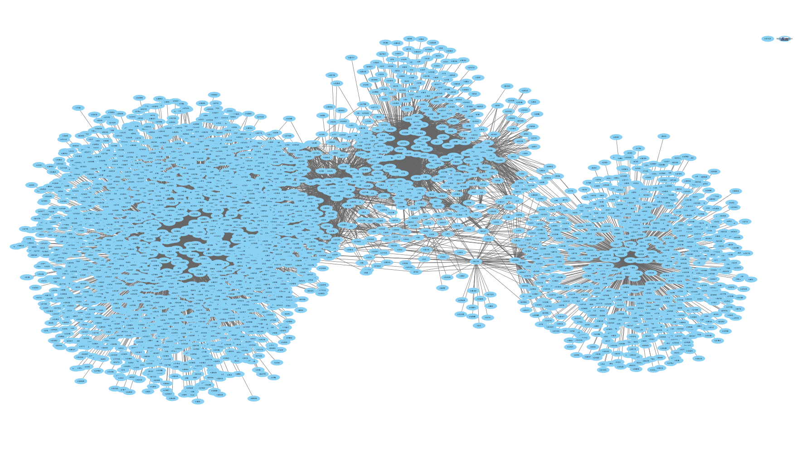
```
\newpage

## Functional Analysis

### Loading annotations from the packages
Document: manuscript-shared-rnaseq/Rmd/init/load_pathogen_annotations.Rmd

```{r eval=FALSE}
#################################################################
# load gene annotations from packages
#################################################################
orgdb <- get("Trypanosoma.brucei.TREU927")

# Fix AnnotationDbi namespace mess
assign('select', dplyr::select, envir=.GlobalEnv)
assign('get',    base::get, envir=.GlobalEnv)

gene_info <- load_parasite_annotations(orgdb, rownames(logcpm.norm.counts.combat),
                                       keytype="GID")

# Get transcript lengths (sum of all exon lengths for each gene)
txdb <- orgdb@txdbSlot
transcript_lengths <- transcriptLengths(txdb)
transcript_lengths <- transcript_lengths[transcript_lengths$gene_id %in%
                                         gene_info$gene_id,]

gene_info[match(transcript_lengths$gene_id, gene_info$gene_id), 
          'transcript_length'] <- transcript_lengths$tx_len
gene_info$transcript_length <- as.numeric(gene_info$transcript_length)

# A gene was excluded in the annotation database as a result of an orphan transcript. Add its placeholder.
## ---not run---
gene_info <- rbind(gene_info, data.frame(gene_id='Tb927.4.4663',
                                         chromosome='4',
                                         description=NA, strand=NA, type=NA,
                                         transcript_length=NA))
  
  
# Keep only the feature information remaining genes
gene_info <- gene_info[gene_info$gene_id %in% rownames(logcpm.norm.counts.combat),] #WGCNA input counts

# For now, just grab the description for the first transcript
#gene_info <- gene_info[!duplicated(gene_info$gene_id),]

# Gene IDs
gene_ids <- rownames(logcpm.norm.counts.combat)

# gene annotations preview
kable(head(gene_info), caption='Preview of gene annotations.')

#########################################################################################
# load GO terms associated with each parasite gene that were downloaded from Tritrypdb
#########################################################################################
# T. brucei go term annotations file path
#go_term_mapping <- "~/tbrucei_annotation_package/build/3.6.0/TriTrypDB-43_TbruceiTREU927_go_table.txt"
#go_terms <- read.table(go_term_mapping, header = TRUE)

# load go terms from annotation package instead
go_terms <- load_go_terms(orgdb, rownames(logcpm.norm.counts.combat), 
                          keytype='GID')

# Exclude genes not found in count table --not run--
#go_terms <- go_terms[go_terms$GID %in% rownames(logcpm.norm.counts.combat),]

# gene / go term mapping
gene_go_mapping <- as.data.frame(unique(go_terms %>% select(GID, GO, ONTOLOGY)))
colnames(gene_go_mapping) <- c('gene', 'category', 'ontology')

# go id / term mapping
go_term_id_mapping <- as.data.frame(unique(go_terms[c('GO', 'TERM', 'ONTOLOGY')]))
colnames(go_term_id_mapping) <- c("category", "term", "ontology")

#########################################################################################
# Load KEGG annotations
#########################################################################################

gene_kegg_mapping <- load_kegg_mapping(orgdb, rownames(logcpm.norm.counts.combat),
                                       keytype="GID")

kegg_pathways <- load_kegg_pathways(orgdb, rownames(logcpm.norm.counts.combat),
                                    keytype="GID")


# Rename gene/KEGG mapping columns to be consistent with GO mapping
colnames(gene_kegg_mapping) <- c('gene', 'category')
colnames(kegg_pathways)     <- c('category', 'name', 'class', 'description')

kegg_pathways <- unique(kegg_pathways)

```

### GO Enrichment

document: manuscript-shared-rnaseq/Rmd/results/go_enrichment_network.Rmd

```{r go_enrichment_modules, message=FALSE, warning=FALSE, results='hide', eval=FALSE}
# save required variables obtained earlier in analysis with variable names of the code below
module_colors <- module.colours
gene_tree <-gene.tree
wgcna_input <- logcpm.norm.counts.combat
modules_of_interest <- interesting.modules
num_modules <- length(unique(module_colors))

# save the module sizes 
# Data frame of module sizes
module_counts <- c()
for (color in unique(module_colors)) {
    module_counts <- append(module_counts, sum(module_colors == color))
}

# create a mapping from module id to number of genes for later use
module_sizes <- data.frame(module_id=unique(module_colors),
                           num_genes=module_counts)

# Initialize parallelization
cl <- makeCluster(max(1, min(10, detectCores() - 2, na.rm = TRUE)))
registerDoParallel(cl)
message("Performing GO enrichment")

# Check each module for enrichment in GO terms and save result in a list
module_go_enrichment <- foreach(color=unique(module_colors), .packages=c('goseq')) %dopar% {
  set.seed(1)
  # Measure GO enrichment for module
  enriched <- tryCatch({
    # module gene ids
    in_module_geneids <- gene_ids[module_colors == color]
    message(sprintf("[GO enrichment] %s", color))
    
    # T. brucei GO enrichment
    enriched <- test_gene_enrichment(in_module_geneids, gene_ids,
                                          gene_go_mapping, gene_lengths)
    
    # Add descriptions
    enriched <- merge(enriched, go_term_id_mapping, by='category')
  }, error=function(e) {
    # goseq fails in some cases; have not been able to track down cause yet
    # to avoid errors we will just return an empty result set
    warning(sprintf("GO enrichment failed for module %s", color))
    cbind(
        get_enrichment_placeholder(),
        term=numeric(0),
        ontology=numeric(0)
    )
  })
  enriched
}
names(module_go_enrichment) <- unique(module_colors)

# remove any null/empty entries from the results
module_go_enrichment <- module_go_enrichment[!sapply(module_go_enrichment, is.null)]

# unregister cpus
stopCluster(cl)
```

```{r print_go_enrichment_modules, results='asis', eval=FALSE}
# Print enrichment results

# temporarily repeat the gene / go term mapping to add 'term' column
gene_go_mapping_tmp <- as.data.frame(unique(go_terms %>% select(GID, GO, TERM, ONTOLOGY)))
colnames(gene_go_mapping_tmp) <- c('gene', 'category', 'term', 'ontology')
  
gene_info_tmp <- gene_info %>% select(-chromosome, -strand,
                                      - type, -transcript_length)
colnames(gene_info_tmp) <- c("gene","description")

tmp <- cbind(gene_info_tmp, color=module_colors)

#tmp <- cbind(gene=gene_ids, color=module_colors)
gene_mapping <- merge(gene_go_mapping_tmp, tmp, by='gene')
cat(sprintf('- Total enriched modules: %d\n', 
            sum(sapply(module_go_enrichment, nrow) > 0)))

# create tables of the results in this document
print_enrichment_results(module_go_enrichment, module_sizes, 'GO terms',
                             #NULL, gene_mapping, output_dir='../results/printed_enrichment_results', 
                             NULL, gene_mapping, 
                             enrichment_type='go',
                             include_gene_lists=FALSE)

  enriched_colors_go <- get_enriched_modules(module_go_enrichment)

# Module enrichment status (used in dendrogram plots)
go_enrichment_status   <- as.numeric(module_colors %in% enriched_colors_go)

```

### KEGG Enrichment

document: manuscript-shared-rnaseq/Rmd/results/kegg_enrichment_network.Rmd

```{r kegg_enrichment_modules, message=FALSE, warning=FALSE, results='hide', eval=FALSE}
# Check each module for enrichment in KEGG terms and save result in a list
cl <- makeCluster(max(1, min(10, detectCores() - 2, na.rm = TRUE)))
registerDoParallel(cl)

message("Performing KEGG enrichment")

# Check each module for enrichment in GO terms and save result in a list
module_kegg_enrichment <- foreach(color=unique(module_colors), .packages=c('goseq')) %dopar% {
  set.seed(1)

  # Measure KEGG enrichment for module
  enriched <- tryCatch({
      in_module_geneids <- gene_ids[module_colors == color]
      enriched <- test_gene_enrichment(in_module_geneids, gene_ids,
                                        gene_kegg_mapping, gene_lengths)
      
      enriched <- unique(merge(enriched, kegg_pathways[,c('category','name')],
                              by='category'))
  }, error=function(e) {
      # goseq fails in some cases; have not been able to track down cause yet
      warning(sprintf("KEGG enrichment failed for module %s", color))
      return(get_enrichment_placeholder())
  })
  enriched
}

names(module_kegg_enrichment) <- unique(module_colors)

# remove any null/empty entries from the results
module_kegg_enrichment <- module_kegg_enrichment[!sapply(module_kegg_enrichment, is.null)]

# unregister cpus
stopCluster(cl)
```

```{r print_kegg_enrichment_modules, results='asis', eval=FALSE}
cat(sprintf('- Total enriched modules: %d\n', 
            sum(sapply(module_kegg_enrichment, nrow) > 0)))

# create tables of the results in this document
print_enrichment_results(module_kegg_enrichment, module_sizes, 
                             'KEGG pathway',
                             #output_dir='../results/printed_enrichment_results',
                             enrichment_type='kegg')

enriched_colors_kegg <- get_enriched_modules(module_kegg_enrichment)

```

```{r enrichment_status, eval=FALSE}
# Module enrichment status (used in dendrogram plots)
kegg_enrichment_status <- as.numeric(module_colors %in% enriched_colors_kegg)
```

```{r module_dendrogram_annotated, results='asis', eval=FALSE}

cat('\n### Dendrogram with annotated modules\n')

unassigned_modules <- as.numeric(module_colors == 'grey')

png(filename = "../figures/gene_tree_and_module_enrichment_status.png", res =1200, 
    type = "cairo", units = 'in', width = 6, height = 6, pointsize = 10)
WGCNA::plotDendroAndColors(gene_tree,
                        cbind(module_colors, go_enrichment_status,
                            kegg_enrichment_status, unassigned_modules),
                        groupLabels=c(sprintf("Modules\n(n=%s)", num_modules),
                                    #sprintf("Red = upregulated at %s", CONFIG$de_cond2),
                                    "GO enrichment", "KEGG enrichment", "Unassigned"),
                        #cex.colorLabels=cex_color_labels, cex.main=cex_main,
                       # cex.axis=cex_axis, cex.lab=cex_lab,
                        dendroLabels=FALSE,
                        #marAll=c(4,8,6,4),
                        guideHang=0.05)
dev.off()
```

```{r fig.cap="Gene tree and module enrichment status", echo=FALSE, out.width='80%'}

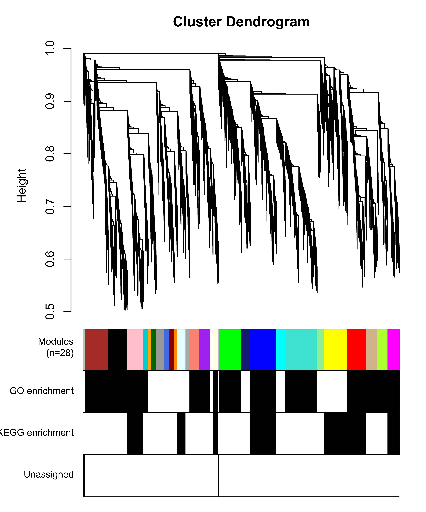
```

### Module labels mappings
```{r eval=FALSE}
module_label_mapping <- rbind(cbind(modules_of_interest,
                                    seq_along(modules_of_interest)),
                              cbind(remaining_modules, #remaining modules variable?
                                    seq_along(remaining_modules) +
                                      length(modules_of_interest)))

module_label_mapping <- as.data.frame(module_label_mapping)
colnames(module_label_mapping) <- c('color', 'number')
```


### Save results

```{r, echo=FALSE, eval=FALSE}
## Save results

###############################################################################
# Save enrichment results as text files
module_output_dir <- "../results/enrichment_results"
if (!dir.exists(module_output_dir)) {
    dir.create(module_output_dir, recursive=TRUE)
}

# GO enrichment 
output_module_enrichment_results(module_go_enrichment, module_output_dir,
'go', go_term_id_mapping)

# KEGG enrichment
output_module_enrichment_results(module_kegg_enrichment, module_output_dir,
'kegg', kegg_pathways %>% select(-description))

#################################################################################
# Create result data frame
result <- cbind(gene_info, color=module_colors)

# drop unneeded columns
keep_cols <- intersect(c('gene_id', 'color', 'description', 'chromosome',
'strand', 'transcript_length'), colnames(result))
result <- tbl_df(result[,keep_cols])

# add expression-related fields
result$expr_variance <- apply(wgcna_input, 1, var)
result$expr_mean <- apply(wgcna_input, 1, mean)

# replace colors with numbers
#module_colors <- module_label_mapping$number[match(module_colors, module_label_mapping$color)]

#result$color <- module_label_mapping$number[match(result$color, module_label_mapping$color)]

# Write out an excel/csv file for the result dataframe
write.table(result, file="../results/coexpression_network_genes.txt", quote = FALSE, sep = "\t")

write.xlsx(result, file="../results/coexpression_network_genes.xlsx")

#################################################################################
correlation_matrix <- cor(network.counts) # check this further to determine whether relationship is correct

# Module Stats
# main_contrast: variable useful if 'result' variable has Differential expression column specified
# "de_comparisons"
#--this code did not work--
module_stats <- create_module_stats_df(result, correlation_matrix, 
                                       wgcna_input,main_contrast)

# Write module stats to a file
write.csv(module_stats, file="../results/module_stats.csv",row.names=FALSE, quote=FALSE)
#################################################################################
# Save module enrichment results in a dataframe and write out to excel
black <- module_go_enrichment$black
tan <- module_go_enrichment$tan    
brown <- module_go_enrichment$brown
blue <- module_go_enrichment$blue  
turquoise <- module_go_enrichment$turquoise
magenta <- module_go_enrichment$magenta    
darkturquoise <- module_go_enrichment$darkturquoise
green <- module_go_enrichment$green                
red <- module_go_enrichment$red    
pink <- module_go_enrichment$pink
salmon <- module_go_enrichment$salmon
lightyellow <- module_go_enrichment$lightyellow
greenyellow <- module_go_enrichment$greenyellow
purple <- module_go_enrichment$purple

go_enrichment_df_list <- c("black","tan","brown","blue","turquoise","magenta","darkturquoise",
                       "green","red","pink","salmon","lightyellow","greenyellow","purple")

  for(name in go_enrichment_df_list){
      write.xlsx(x = get(name), 
                 file = "../results/Module_go_enrichment_results.xlsx", 
                 sheetName = name, append=TRUE, row.names = FALSE)
  }

####################################################################################
#save KEGG enrichment results

red <- module_kegg_enrichment$red    
pink <- module_kegg_enrichment$pink
lightyellow <- module_kegg_enrichment$lightyellow
blue <- module_kegg_enrichment$blue
yellow <- module_kegg_enrichment$yellow
lightcyan <- module_kegg_enrichment$lightcyan
magenta <- module_kegg_enrichment$magenta


kegg_enrichment_df_list <- c("blue","magenta","red","pink","lightyellow","yellow","lightcyan")

for(name in kegg_enrichment_df_list){
      write.xlsx(x = get(name), 
                 file = "../results/Module_kegg_enrichment_results.xlsx", 
                 sheetName = name, append=TRUE, row.names = FALSE)
  }

######################################################################################
# save module hub genes domain description
module_hub_genes_description <- gene_info %>% filter(gene_id %in% as.data.frame(module.hub.genes)$module.hub.genes) %>% select(gene_id, description)

module_hub_genes_df <- as.data.frame(module.hub.genes)

module_hub_genes_df <- tibble::rownames_to_column(module_hub_genes_df, var="module")

module_hub_genes_domain_description <- merge(module_hub_genes_df, module_hub_genes_description,
                                             by.x="module.hub.genes", by.y="gene_id")

# reorder and rename columns 
module_hub_genes_domain_description <- module_hub_genes_domain_description[,c(2,1,3)]

module_hub_genes_domain_description <- module_hub_genes_domain_description %>%
  dplyr::rename(hub_gene=module.hub.genes)

write.xlsx(module_hub_genes_domain_description,
           file = "../results/hub_genes.xlsx",
           #append = TRUE,
           row.names = FALSE)

#########################################################################################
# Add hub genes and description to top GO terms in each module

modules_top_over_represented_go_terms <-readxl::read_excel('../results/modules_top_over_represented_go_terms.xlsx')

enriched_modules_hub_genes <- module_hub_genes_domain_description %>% filter(module %in% modules_top_over_represented_go_terms$module)

modules_top_over_represented_go_terms_and_hub_genes <- merge(modules_top_over_represented_go_terms,
                                                             enriched_modules_hub_genes, by="module")

write.xlsx(modules_top_over_represented_go_terms_and_hub_genes,
           file = "../results/modules_top_over_represented_go_terms_and_hub_genes.xlsx",
           #append = TRUE,
           row.names = FALSE)

######################################################################################
# write to excel DE hub genes expressed through out life cycle stages and their different LogFC in contrasts

contrast_common_de_genes_logFC_hub_genes <- contrast_common_de_genes_logFC %>% filter(gene_id %in% modules_top_over_represented_go_terms_and_hub_genes$hub_genes)

modules_top_over_represented_go_terms_and_hub_genes_logFC <- merge(modules_top_over_represented_go_terms_and_hub_genes,
                                                                   contrast_common_de_genes_logFC_hub_genes,
                                                                   by.x="hub_genes", by.y = "gene_id")

modules_top_over_represented_go_terms_and_hub_genes_logFC <- modules_top_over_represented_go_terms_and_hub_genes_logFC %>% select(-num_total, -num_in_subset)

# reorder columns
modules_top_over_represented_go_terms_and_hub_genes_logFC <- modules_top_over_represented_go_terms_and_hub_genes_logFC[,c(2:6,1,7:9)]

# write output to excel
write.xlsx(modules_top_over_represented_go_terms_and_hub_genes_logFC,
           file = "../results/common_differentially_expressed_hub_genes_logFC_comparison.xlsx",
           #append = TRUE,
           row.names = FALSE)

#######################################################################################
# write hub genes and common DEG across contrasts to output text files for cytoscape analysis

#hub genes
write.table(module_hub_genes_domain_description$hub_genes, file="../results/hub_genes.txt", quote = FALSE, row.names = FALSE)

#common DEGs
write.table(contrast_common_de_genes_logFC$gene_id, file="../results/common_DEG_across_contrasts.txt", quote = FALSE, row.names = FALSE)

```

## FIRE (Finding Informative Regulatory Elements)
Module genes and their module labels are required as input by FIRE (Finding Informative Regulatory Elements). Hence we write out text files with this input.

```{r eval=FALSE}
# write out cluster/module genes and their corresponding module labels for use by 
# FIRE (Finding Informative Regulatory Elements)

fire.clusters <- data.frame(modGenes, module.labels[inModules])
fire.clusters.colours <- data.frame(modGenes, module.labels[inModules], module.colours[inModules])

# sort by module labels; FIRE input should start from 0 in module labels column.
fire.clusters <- fire.clusters[order(fire.clusters$module.labels.inModules.), c(1,2)]
fire.clusters.colours <- fire.clusters.colours[order(fire.clusters.colours$module.labels.inModules.), c(1,2,3)]

# rename columns
colnames(fire.clusters) <- c("gene", "label")
colnames(fire.clusters.colours) <- c("gene", "label","colour")

write.table(as.data.frame(fire.clusters.colours), file = "../results/tbrucei_FIRE_expression_clusters_and_colour.txt", 
            quote = FALSE, row.names = FALSE, sep = "\t")
    
# Also, write out module genes in a text file.
write.table(data.frame(modGenes), file = "../results/tbrucei_module_genes.txt", row.names = FALSE, quote = FALSE, col.names = FALSE)
```

Prepare input sequences for FIRE by obtaining module genes sequences from *T. brucei*'s entire annotated transcripts. Use `seqtk` package.

```{bash, eval=FALSE, engine="sh"}
# remove unrequired info from header and retain gene id.
cut -f2 -d "|" ../data/tbrucei_annotated_transcripts/TriTrypDB-43_TbruceiTREU927_AnnotatedTranscripts.fasta | cut -f2 -d " " | cut -f1 -d " " | cut -f2 -d "=" > ../results/tbrucei_annotated_transcript_sequences_gene_as_header.fasta

# add ">" symbol to header
awk '{ if ($0 ~ /Tb/) { printf ">"; } print $0; }' ../results/tbrucei_annotated_transcript_sequences_gene_as_header.fasta > ../results/tbrucei_annotated_transcript_sequences.fasta

# obtain module gene sequences
seqtk subseq ../results/tbrucei_annotated_transcript_sequences.fasta \
../results/tbrucei_module_genes.txt > \
../results/tbrucei_module_genes_sequences_FIRE_input.fasta

seqkit grep -n -f ../results/tbrucei_module_genes_sorted.txt ../results/tbrucei_annotated_transcript_sequences.fasta > ../results/tbrucei_module_genes_sequences_FIRE_input.fasta1

# FIRE commands - FIRE should be run in the directory where all scripts were installed. Therefore,
# the input files should be copied to FIRE's directory (FIRE-x.x/)
#
#check whether input files are OK
perl TOOLS/FIRE_analyse_input_files.pl \
-fastafile tbrucei_module_genes_sequences_without_delimiter.fasta \
-expfile tbrucei_FIRE_expression_clusters.txt

# remove sequences >= 10,000 base pairs as they make FIRE crash
# code - https://www.biostars.org/p/62678/
 cat ../results/tbrucei_module_genes_sequences_without_delimiter.fasta | \
 awk '{y= i++ % 2 ; L[y]=$0; if(y==1 && length(L[1])<=9999) {printf("%s\n%s\n",L[0],L[1]);}}' > \
../results/tbrucei_module_genes_sequences_without_delimiter_filtered.fasta

# recheck input files
perl TOOLS/FIRE_analyse_input_files.pl \
-fastafile tbrucei_module_genes_sequences_without_delimiter_filtered.fasta \
-expfile tbrucei_FIRE_expression_clusters.txt

# output
#Checking the expression file
#Expression file is OK.
#
#Checking the fasta file
#Fasta file is OK (min sequence length = 98, max length = 9917).
#
#Found fasta sequence for 7272 / 7390 identifiers in expression file.

# Analyze sequences for motifs
 perl fire.pl --expfiles=tbrucei_FIRE_expression_clusters.txt --exptype=discrete \
 --fastafile_dna=tbrucei_module_genes_sequences_without_delimiter_filtered.fasta  --nodups=1

# create HTML output of the results
perl MORESCRIPTS/makeresultindex.pl tbrucei_FIRE_expression_clusters.txt "T. brucei cluster motifs"
```


