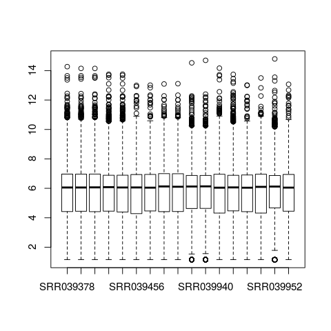

```{r setup, include=FALSE}
library("knitr")
opts_chunk$set(echo = TRUE,
               fig.pos = 'h',
               fig.align = 'center',
               fig.show='hold')

```
## Introduction
This document contains the workflow used in the analysis of *T. brucei* gene co-expression network analysis. It contains code used in each step of the analysis.

### Setting up R for the analysis

```{r results='hide', eval=FALSE}
# set working directory
setwd("./tbrucei_gcn/analysis")

# ensure results are reproducible
set.seed(1)

# other settings
options(digits = 4)
options(stringsAsFactors = FALSE)

# loading required R packages
library("dupRadar")
library("Rsubread")
library("limma")
library("edgeR")
library("RColorBrewer")
library("ggplot2")
library("gplots")
library("reshape2")
library("ggfortify")
library("xlsx")
library("WGCNA")
library("flashClust")
library("igraph")

# set number of threads to allow in WGCNA analysis
allowWGCNAThreads(nThreads=20)
```

## Data acquisition
Data used in this study is obtained from European Nucleotide Archive under accession number SRP002243.

First, metadata for the data is obtained from EBI as follows:

```{r echo=TRUE, results='hide', eval=FALSE}
#Obtain metadata information for the data used in this study from ENA and SRA databases.

# ENA metadata
# code adapted from: https://wiki.bits.vib.be/index.php/Download_read_information_and_FASTQ_data_from_the_SRA
accession <- "SRP002243"
ena.url <- paste("http://www.ebi.ac.uk/ena/data/warehouse/filereport?accession=",
                 accession,
                 "&result=read_run",
                 "&fields=run_accession,library_name,",
                 "read_count,fastq_ftp,fastq_aspera,",
                 "fastq_galaxy,sra_ftp,sra_aspera,sra_galaxy,",
                 "&download=text",
                 sep="")
ENA.metadata <- read.table(url(ena.url), header=TRUE, sep="\t")

# SRA metadata
SRA.metadata <- read.table("../data/SraRunTable.metadata.txt", header = TRUE, sep = "\t")

# obtain sample metadata to be used later in analysis.
matches <- c("Run","Library_Name","Sample_Name")
sample.metadata <- SRA.metadata[grepl(paste(matches, collapse="|"), names(SRA.metadata))]

# create grouping factor that will place each sample in the one of three tissues i.e.
# midgut (MG), proventriculus(PV) and salivary glands (SG)
tissue <- factor(c("MG", "MG", "MG", "MG", "MG", "PV", "PV", "SG", "SG", "SG", "SG", "MG", "MG", "PV", "SG", "SG", "PV"))

# append factor to sample.metadata to group samples
sample.metadata["Tissue"] <- tissue

# remove a sample with less than 10M reads from the analysis
#sample.metadata <- sample.metadata[-15,] #keep commented to avoid accidentally running

# create a text file with urls to fastq files in ENA database
fastq.urls <- ENA.metadata[grepl("fastq_ftp", names(ENA.metadata))]
write.csv(fastq.urls, file="../data/fastq.urls.txt", eol = "\r\n", quote = FALSE, row.names = FALSE)
```
```{r, eval=FALSE, echo=TRUE}
# print out the sample metadata table
kable(sample.metadata)
```


Next, RNASeq data is downloaded from EBI database's FTP site.

```{bash}
cat ../scripts/fastq_download.sh
```

Some of the downstream tools require that FASTQ files that were downloaded in zipped form are unzipped.

```{bash}
cat ../scripts/unzip.sh
```

## Data quality assessment
After downloading the RNASeq data, its quality is checked through the FASTQC tool whose output is a report in HTML format.

```{bash}
cat ../scripts/fastqc_reports.sh
```

Following the high rate of unaligned and duplicate reads after FASTQC analysis, further analysis is done to ascertain their cause. The reads are aligned to *Glossina morsitans* genome to determine whether reads from the vector were also present in the sample during sequencing. Duplicate reads are assessed whether they are artifacts from PCR (PCR duplicates).

## Downloading *T. brucei* and *G. morsitans* genome and annotation files

The genome and annotation files are downloaded from the TriTrypDB and vectorbase databases as follows:

```{bash}
#Downloading T. brucei genome

#wget https://tritrypdb.org/common/downloads/release-43/TbruceiTREU927/fasta/data/TriTrypDB-43_TbruceiTREU927_Genome.fasta -P ../data/tbrucei_genome/

#Downloading the GFF file
#wget https://tritrypdb.org/common/downloads/release-43/TbruceiTREU927/gff/data/TriTrypDB-43_TbruceiTREU927.gff -P ../data/tbrucei_genome_annotations_GFF/

# convert the tbrucei gene annotation from GFF format to GTF (required by some downstream tools)
# uses gffread from cufflinks
#mkdir -P ../data/tbrucei_genome_annotations_GTF

#gffread ../data/tbrucei_genome_annotations_GFF/TriTrypDB-43_TbruceiTREU927.gff -T -o ../data/tbrucei_genome_annotations_GTF/TriTrypDB-43_TbruceiTREU927.gtf

# Downloading Glossina genome
#wget https://www.vectorbase.org/download/glossina-morsitans-yalescaffoldsgmory1fagz -P ../data/glossina_genome_scaffolds/

# Downloading GTF file
#wget https://www.vectorbase.org/download/glossina-morsitans-yalebasefeaturesgmory19gtfgz -P ../data/glossina_annonations_GTF/

```

Next, *T. brucei* and *G. morsitans* genome files are concatenated into a single fasta file which is used during the alignment of the reads. This ensures no cross-mapping of reads take place.

```{bash}
# make a directory to store the concatenated genomes
# mkdir -P ../data/brucei-morsitans

# copy the genome files to the created directory and concatenate them
#cp ../data/glossina_genome_scaffolds/glossina-* ../data/brucei-morsitans/
#cp ../data/tbrucei_genome/*.fasta ../data/brucei-morsitans/
# cat ../data/brucei-morsitans/*.fa* > ../data/brucei-morsitans/brucei-morsitans_genomes.fasta
```


## Alignment of reads on the genome

Here, HISAT2 is used to align reads on the *T. brucei* and *G. morsitans* genomes. The first step is indexing the genome using HISAT2 followed by alignment of the reads. The output is SAM files.

### Indexing the genome

```{bash}
cat ../scripts/hisat2_index.sh
```

### Aligning the reads to the genome

```{bash}
cat ../scripts/hisat2_align.sh
```

## Assessment of the duplication rate
At this point, quality control to assess the duplication rate can be performed.
First, the SAM files are converted to sorted BAM files required by dupRadar tool.

```{bash}
cat ../scripts/sam-to-bam.sh
```

The BAM files are then sorted using samtools

```{bash}
cat ../scripts/sort_bam.sh
```

Next, duplicates are marked in the BAM files using Picard.

```{bash}
cat ../scripts/mark_dupes.sh
```

At this point, dupRadar tool is used to perform quality control in R.
Before this quality control can be performed, we need to verify whether the reads are stranded or not as this is a required parameter for dupRadar as well as HTSeq tool later in the analysis. This can be done using RSeQC package - An RNA-seq Quality Control Package. `infer_exprement.py` module is used in this case.

First we convert *T. brucei* genome annotation GTF file into `bed` format required by RSeQC package. Then we use `infer_exprement.py` to verify strandedness using a few samples.

```{bash}
# convert GTF genome annotation to BED format using a custom script from:
#https://github.com/ExpressionAnalysis/ea-utils/tree/master/clipper

#./gtf2bed.pl ../data/tbrucei_genome_annotations_GTF/TriTrypDB-43_TbruceiTREU927.gtf > ../data/tbrucei_genome_annotations_GTF/TriTrypDB-43_TbruceiTREU927.bed

#infer_experiment.py -i ../data/processed_data/bru-mor_bam/SRR039381.bam -r ../data/tbrucei_genome_annotations_GTF/TriTrypDB-43_TbruceiTREU927.bed
```

The next step is to run the dupRadar quality control analysis setting the `stranded` parameter as `FALSE` as the reads are not stranded.

```{r eval=FALSE}
# Parameters
bam_file <- "../data/processed_data/bru-mor_bam/SRR039378.dupMarked.bam"
gtf_file <- "../data/brucei-morsitans/brucei-morsitans_annotations.gtf"
stranded <- 0
paired <- FALSE
Threads <- 12

# Duplication rate ananlysis
dm <- analyzeDuprates(bam_file, gtf_file, stranded, paired, Threads)

#Plots
png(filename = "../figures/duplication_rate/SRR039378.png")
duprateExpDensPlot(DupMat=dm)
title("SRR039378")
dev.off()

# Boxplot
duprateExpBoxplot(DupMat=dm)
```


## Reads quantification

HTSeq tool is used to count reads that aligned to the *T. brucei* genome. *T. brucei* annonation file is used and therefore HTSeq excludes counting *G. morsitans* reads that aligned to *Glossina* genome. The output is a text file for each sample that contains the number of reads that were counted for each gene.

```{bash}
cat ../scripts/htseq_counts.sh
```

## Generating MultiQC report

MultiQC aggregates results from FASTQC, HISAT2 and HTSeq analysis into an HTML formatted single report for better visualization.

```{bash}
#change directory to results
cd ../results

#Run multiqc
#multiqc .
```


## Analysis in R

### Importing samples count data into R

For further analysis, samples read counts are read into R. To read the sample counts data into R using the script below, simply type `source("../scripts/htseq-combine_all.R")` on the R console and hit enter. Here, ensure the sample to be excluded in the analysis (SRR039951) is not among the input files.

```{bash}
cat ../scripts/htseq-combine_all.R
```

### Sample quality check

The quality of the samples is checked before further analysis to check for outlier and batch effects.

```{r eval=FALSE}
# Create a DGEList object
counts <- DGEList(data.all, group = sample.metadata$Tissue)

# check the number of genes with no expression in all samples
table(rowSums(counts$counts==0)==16)
# FALSE  TRUE 
# 10051  1781
##################################################################
#used the alternative function below instead of this
#
# filter out Non-expressed genes and those with low expression values.
# keep genes with at least 1 read per million in n samples, where n 
# is minimum number of replicates which is 3 in this case
keep <- rowSums(cpm(counts)>1) >= 3

# retain genes above the cpm value
#filtered.counts <- counts[keep, , keep.lib.sizes=FALSE]
##################################################################

# Filtering non-expressed and lowly-expressed genes.
#
# Alternative filtering function that filters better (Law et al 2016)
# retain genes above a calculated cpm value
keep.exprs <- filterByExpr(counts, group=sample.metadata$Sample_Name)
filtered.counts <- counts[keep.exprs,, keep.lib.sizes=FALSE]

# obtain logCPM unnormalized for plotting purposes.
# Here, the norm.factors value is 1 for all samples
logcpm.unnorm.counts <- cpm(filtered.counts, log = TRUE, prior.count = 2, normalized.lib.sizes = TRUE)

# Normalize for composition bias using TMM
filtered.counts <- calcNormFactors(filtered.counts, method = 'TMM')

# Convert counts per million per gene to log counts per million for further downstream analysis.
logcpm.norm.counts <- cpm(filtered.counts, log = TRUE, prior.count = 2, normalized.lib.sizes = TRUE)

```

Various plots are made for the samples before and after normalization.

\newpage

**Samples heatmap**
```{r results='hide', eval=FALSE}
sample_category <- nlevels(sample.metadata$Sample_Name)
colour.palette <- colorRampPalette(brewer.pal(sample_category, "Set2"))(sample_category)
sample.colours <- colour.palette[as.integer(sample.metadata$Sample_Name)]

# Unnormalized sample heatmap
png(filename = "../figures/unnorm_sample_heatmap.png", res =1200, type = "cairo", units = 'in',
    width = 5, height = 4, pointsize = 10)
heatmap.2(cor(logcpm.unnorm.counts), RowSideColors=sample.colours, trace='none', main='Sample correlations')
dev.off()

# Normalized sample heatmap
png(filename = "../figures/norm_sample_heatmap.png", res =1200, type = "cairo", units = 'in',
    width = 5, height = 4, pointsize = 10)
heatmap.2(cor(logcpm.norm.counts), RowSideColors=sample.colours, trace='none', main='Sample correlations')

dev.off()
```


```{r fig.cap="sample correlation heatmap", echo=FALSE}
include_graphics("../figures/unnorm_sample_heatmap.png")
```

\newpage
```{r fig.cap="Normalized sample correlation heatmap", echo=FALSE, out.width="75%"}

include_graphics("../figures/norm_sample_heatmap.png")
```

\newpage
 **Samples density plot**
```{r eval=FALSE, results='hide'}
# Checking further using sample density plot

# raw data
log.counts <- log2(counts$counts + 1)
png("../figures/raw_sample_density.png", res =1200, type = "cairo", units = 'in',
   width = 6, height = 6, pointsize = 10)
x <- melt(as.matrix(log.counts))

colnames(x) <- c('gene_id', 'sample', 'log')
ggplot(x, aes(x=log, color=sample)) + geom_density()
dev.off()

# filtered and unnormalized sample data
png("../figures/unnorm_sample_density.png", res =1200, type = "cairo", units = 'in',
    width = 6, height = 4, pointsize = 10)
x <- melt(as.matrix(logcpm.unnorm.counts))

colnames(x) <- c('gene_id', 'sample', 'logcpm')
ggplot(x, aes(x=logcpm, color=sample)) + geom_density()

dev.off()

# filtered and normalized sample data
png("../figures/norm_sample_density.png", res =1200, type = "cairo", units = 'in',
    width = 6, height = 4, pointsize = 10)
x <- melt(as.matrix(logcpm.norm.counts))

colnames(x) <- c('gene_id', 'sample', 'logcpm')
ggplot(x, aes(x=logcpm, color=sample)) + geom_density()

dev.off()
```


```{r fig.cap="Raw sample density plot", echo=FALSE}
include_graphics("../figures/raw_sample_density.png")
```

\newpage
```{r fig.cap="Normalized sample density plot", echo=FALSE}

include_graphics("../figures/norm_sample_density.png")
```

\newpage
 **Principal component analysis**
```{r eval=FALSE, results='hide'}
# PCA

# raw samples PCA
pca.log.counts <- prcomp(t(log.counts)) # raw data (unnormalized and unfiltered)
png(filename = "../figures/raw_samples_PCA.png", res =1200, type = "cairo", units = 'in',
    width = 6, height = 4, pointsize = 10)
autoplot(pca.log.counts,
         data = sample.metadata,
         colour="Sample_Name",
         size=3)
dev.off()

# unnormalized samples PCA
pca.log.counts <- prcomp(t(logcpm.unnorm.counts))  #unnormalized & filtered
png(filename = "../figures/unnorm_sample_PCA.png", res =1200, type = "cairo", units = 'in',
    width = 6, height = 4, pointsize = 10)
autoplot(pca.log.counts,
         data = sample.metadata,
         colour="Sample_Name",
         size=3)
dev.off()


# normalized samples PCA
pca.log.counts <- prcomp(t(logcpm.norm.counts))  #normalized & filtered
png(filename = "../figures/norm_sample_PCA.png", res =1200, type = "cairo", units = 'in',
    width = 6, height = 4, pointsize = 10)
autoplot(pca.log.counts,
         data = sample.metadata,
         colour="Sample_Name",
         size=3)
dev.off()
```


```{r fig.cap="Raw Sample heatmap", echo=FALSE}
include_graphics("../figures/raw_samples_PCA.png")
```

\newpage
```{r fig.cap="Unnormalized sample PCA", echo=FALSE}

include_graphics("../figures/unnorm_sample_PCA.png")
```

\newpage
```{r fig.cap="Normalized sample PCA", echo=FALSE}

include_graphics("../figures/norm_sample_PCA.png")
```
\newpage
 **Boxplot**
```{r, eval=FALSE}
# raw sample boxplot
png(filename = "../figures/raw_sample_boxplot.png", res =1200, type = "cairo", units = 'in',
    width = 4, height = 4, pointsize = 6)
y <- melt(as.matrix(log.counts))

colnames(y) <- c('gene_id', 'sample', 'log')
ggplot(y, aes(x=sample, y=log)) + geom_boxplot() + theme(axis.text.x  = element_text(angle=90, vjust=0.5))
dev.off()

# unnormalized sample boxplot
png(filename = "../figures/unnorm_sample_boxplot.png", res =1200, type = "cairo", units = 'in',
    width = 4, height = 4, pointsize = 6)
y <- melt(as.matrix(logcpm.unnorm.counts))

colnames(y) <- c('gene_id', 'sample', 'logcpm')
ggplot(y, aes(x=sample, y=logcpm)) + geom_boxplot() + theme(axis.text.x  = element_text(angle=90, vjust=0.5))
dev.off()

# normalized sample boxplot
png(filename = "../figures/norm_sample_boxplot.png", res =1200, type = "cairo", units = 'in',
    width = 4, height = 4, pointsize = 6)
y <- melt(as.matrix(logcpm.norm.counts))

colnames(y) <- c('gene_id', 'sample', 'logcpm')
ggplot(y, aes(x=sample, y=logcpm)) + geom_boxplot() + theme(axis.text.x  = element_text(angle=90, vjust=0.5))
dev.off()
```


```{r fig.cap="Unnormalized Sample boxplot", echo=FALSE}
include_graphics("../figures/unnorm_sample_boxplot.png")
```

\newpage
```{r fig.cap="Normalized sample boxplot", echo=FALSE}


``` 

\newpage 
### Identify differentially expressed genes

```{r eval=FALSE}
# Apply sample grouping based on Tissue from which the sample was derived
design <- model.matrix(~0+sample.metadata$Tissue)
colnames(design) <- levels(sample.metadata$Tissue)

# Estimate dispersions for tags
filtered.counts <- estimateDisp(filtered.counts, design, robust = TRUE)

# Fit a generalized likelihood model to the DGELIST using sample grouping
fit <- glmFit(filtered.counts,design)

#################################################################
# code in this section adapted from https://github.com/iscb-dc-rsg/2016-summer-workshop
# generate a list of all possible pairwise contrasts
condition_pairs <- t(combn(levels(sample.metadata$Tissue), 2))

comparisons <- list()
for (i in 1:nrow(condition_pairs)) {
  comparisons[[i]] <- as.character(condition_pairs[i,])
}

# remove MG to SG comparison
comparisons[[2]] <- NULL

# vector to store differentially expressed genes
sig_genes <- c()

# iterate over the contrasts, and perform a differential expression test for
# each pair
for (conds in comparisons) {
    # generate string contrast formula
    contrast_formula <- paste(conds, collapse=' - ')

    contrast_mat <- makeContrasts(contrasts=contrast_formula, levels=design)
    contrast_lrt <- glmLRT(fit, contrast=contrast_mat)
    topGenes <- topTags(contrast_lrt, n=Inf, p.value=0.05, adjust.method = "BH")
    
    # Grab highly ranked genes
    sig_genes <- union(sig_genes, rownames(topGenes$table))
}

# Filter out genes which were not differentially expressed for any contrast
de.genes <- filtered.counts[rownames(filtered.counts) %in% sig_genes,]
dim(de.genes$counts)
#4838   16
################################################################

# Obtain the counts of genes expressed for each contrast individually
# This aims to obtain the number of genes differentially expressed between 
# the 3 stages of development i.e. MG -> PV, PV -> SG

# Likelihood ratio test to identify DEGs
# SG compared to PV
SG_vs_PV_lrt <- glmLRT(fit, contrast=c(0,-1,1))

# PV compared to MG
PV_vs_MG_lrt <- glmLRT(fit, contrast = c(-1,1,0))


# Genes with most significant differences (using topTags)
# SG compared to PV
topGenes_SG <- topTags(SG_vs_PV_lrt, adjust.method = "BH", p.value = 0.05, n=Inf)
dim(topGenes_SG)
#3641    5

# PV compared to MG
topGenes_PV <- topTags(PV_vs_MG_lrt, adjust.method = "BH", p.value = 0.05, n=Inf)
dim(topGenes_PV)
#2832    5

#Total number of genes: 6473
#######################################################################################
# DE genes at 5% FDR (using decideTestsDGE function)
#
# SG compared to PV
SG_vs_PV_de.genes <- decideTestsDGE(SG_vs_PV_lrt, adjust.method = "BH", p.value = 0.05)

# get summary
summary(SG_vs_PV_de.genes)
#       -1*PV 1*SG
#Down         1760
#NotSig       4076
#Up           1881

# PV compared to MG
PV_vs_MG_de.genes <- decideTestsDGE(PV_vs_MG_lrt, adjust.method = "BH", p.value = 0.05)

# summary
summary(PV_vs_MG_de.genes)
#       -1*MG 1*PV
#Down         1493
#NotSig       4885
#Up           1339

# DE genes in the PV that are common in both comparisons
de.common <- which(PV_vs_MG_de.genes!=0 & SG_vs_PV_de.genes!=0)
length(de.common)
#1635

# create a dataframe with data on PV and SG differential gene expression
PV_data <- topGenes_PV$table
SG_data <- topGenes_SG$table

# append status of regulation for each gene (either upregulated, 1 or downregulated, -1)
## appending result was erroneous; status (+ or -) did not coincide with logFC sign (+ or -). why?
PV_data$RegulationStatus <- PV_vs_MG_de.genes[rownames(PV_vs_MG_de.genes) %in% rownames(PV_data),]
SG_data$RegulationStatus <- SG_vs_PV_de.genes[rownames(SG_vs_PV_de.genes) %in% rownames(SG_data),]

# obtain upregulated and downregulated genes and write out to excel
PV_DownReg <- PV_data[order(PV_data$logFC),]
PV_UpReg <- PV_data[order(PV_data$logFC, decreasing = TRUE),]

SG_DownReg <- SG_data[order(SG_data$logFC),]
SG_UpReg <- SG_data[order(SG_data$logFC, decreasing = TRUE),]

write.xlsx(PV_DownReg, file = "../results/Significant_differentially_expressed_genes.xlsx",
           sheetName = "Down-regulated Proventriculus")
write.xlsx(PV_UpReg, file = "../results/Significant_differentially_expressed_genes.xlsx",
           sheetName = "Up-regulated Proventriculus", append = TRUE)
write.xlsx(SG_DownReg, file = "../results/Significant_differentially_expressed_genes.xlsx",
           sheetName = "Down-regulated Salivary glands", append = TRUE)
write.xlsx(SG_UpReg, file = "../results/Significant_differentially_expressed_genes.xlsx",
           sheetName = "Up-regulated Salivary glands", append = TRUE)
```

Plotting to visually inspect differential gene expression results.

```{r, eval=FALSE}
# Differential expression analysis - plots
#
# Volcano plots

#table with negative log to base 10 transformed p-values and logFC
# create a plot for each comparison PV-MG and SG-PV one at a time.
tab <- data.frame(logFC = topGenes_PV$table$logFC, 
                  negLogPval = -log10(topGenes_PV$table$PValue)) # PV compared to MG

tab <- data.frame(logFC = topGenes_SG$table$logFC, 
                  negLogPval = -log10(topGenes_SG$table$PValue)) # SG compared to PV

# generating the plot
png("../figures/SG-PV_DEG_volcanoplot.png", res =1200, type = "cairo", units = 'in',
    width = 4, height = 4, pointsize = 8)
par(mar = c(5, 4, 4, 4))
plot(tab, pch = 16, cex = 0.6, xlab = expression(log[2]~fold~change),
ylab = expression(-log[10]~pvalue), main = "SG vs PV differentially expressed genes")

## Log2 fold change and p-value cutoffs
lfc <- 2
pval <- 0.05

## Select interesting genes
signGenes <- (abs(tab$logFC) > lfc & tab$negLogPval > -log10(pval))

## Identifying the selected genes
points(tab[signGenes, ], pch = 16, cex = 0.8, col = "red")
abline(h = -log10(pval), col = "green3", lty = 2)
abline(v = c(-lfc, lfc), col = "blue", lty = 2)
mtext(paste("pval =", pval), side = 4, at = -log10(pval), cex = 0.8, line = 0.5, las = 1)
mtext(c(paste("-", lfc, "fold"), paste("+", lfc, "fold")), side = 3, at = c(-lfc, lfc),
cex = 0.8, line = 0.5)

dev.off()

# create a venn diagram to show distribution of the number DEGs between stages
```

```{r, fig.cap="Differentially expressed genes in the proventriculus compared to midgut", echo=FALSE}
# Genes differentially expressed in proventriculus compared to midgut (above p<0.05)
include_graphics("../figures/PV-MG_DEG_volcanoplot.png")
```

```{r, fig.cap="Differentially expressed genes in the salivary gland compared to proventriculus", echo=FALSE}
# Genes differentially expressed in salivary gland compared to proventriculus (above p<0.05)
include_graphics("../figures/SG-PV_DEG_volcanoplot.png")
```


### Weighted gene co-expression analysis
```{r, eval=FALSE}
########################################################################
## Constructing the network
########################################################################

# obtain the required counts data (WGCNA input)
# WGCNA requires genes to be in columns
network.counts <- t(logcpm.norm.counts)

# determine the soft-thresholding power to use
powers <- c(c(1:10), seq(from = 12, to=20, by=2))
sft <- pickSoftThreshold(network.counts, powerVector = powers, verbose = 5)

# results
#sizeGrWindow(9, 5)
par(mfrow = c(1,2))

cex1 <- 0.9

# Scale-free topology fit index as a function of the soft-thresholding power
png(filename = "../figures/soft-thresholding_power.png", res =1200, type = "cairo", units = 'in',
    width = 4, height = 4, pointsize = 10)
plot(sft$fitIndices[,1], -sign(sft$fitIndices[,3])*sft$fitIndices[,2], 
     xlab="Soft Threshold (power)", 
     ylab="Scale Free Topology Model Fit,signed R^2",type="n", 
     main = paste("Scale independence"));
text(sft$fitIndices[,1], -sign(sft$fitIndices[,3])*sft$fitIndices[,2],
     labels=powers,cex=cex1,col="red");

# The red line corresponds to using an R^2 cut-off of h
abline(h=0.80,col="red")
dev.off()

# Mean connectivity as a function of the soft-thresholding power
png(filename = "../figures/mean_connectivity.png", res =1200, type = "cairo", units = 'in',
    width = 4, height = 5, pointsize = 10)
plot(sft$fitIndices[,1], sft$fitIndices[,5], 
     xlab="Soft Threshold (power)", 
     ylab="Mean Connectivity", type="n", 
     main = paste("Mean connectivity"))
text(sft$fitIndices[,1], sft$fitIndices[,5], labels=powers, cex=cex1,col="red")
dev.off()

# construct adjacency matrix
softpower <- 16
adjacency.matrix <- adjacency(network.counts, power=softpower,
                                             type = "signed", corFnc = "cor")

#set diagonal to 0 to remove uninformative correlations
diag(adjacency.matrix) <- 0

# Turn the adjacency matrix to topologicaal overlap matrix to minimize
# the effects of noise and spurious associations
TOM <- TOMsimilarity(adjacency.matrix, TOMType = "signed")
dissTOM <- 1 - TOM

# remove adjacency matrix to free up memory
rm(adjacency.matrix)
gc()

# Adjacency matrix heatmap plot / network heatmap of selected genes
heatmap_indices <- sample(nrow(dissTOM), 500) # sub-sample for visualization purposes

png(filename = "../figures/adjacency_matrix_heatmap.png", res =1200, type = "cairo", units = 'in',
    width = 5, height = 5, pointsize = 10)
heatmap.2(t(dissTOM[heatmap_indices, heatmap_indices]),
            col=redgreen(75),
            labRow=NA, labCol=NA, 
            trace='none', dendrogram='row',
            xlab='Gene', ylab='Gene',
            main='Adjacency matrix',
            density.info='none', revC=TRUE)
dev.off()

################################################################
## Detecting co-expression modules in R
################################################################

# view the dendrogram based on hierachical clustering of genes
gene.tree <- flashClust(as.dist(dissTOM), method = "average")

# plot the gene tree
png(filename = "../figures/gene_tree.png", res =1200, type = "cairo", units = 'in',
    width = 7, height = 8, pointsize = 10)
#sizeGrWindow(12,9) #open graphical window
plot(gene.tree, xlab="", sub="", main = "Gene clustering based on TOM dissimilarity", 
     labels = FALSE, hang = 0.04)
dev.off()

# identify the modules
module.labels <- cutreeDynamicTree(gene.tree, deepSplit = FALSE, 
                                   minModuleSize = 30)

#view
table(module.labels)

# convert labels to colours
module.colours <- labels2colors(module.labels)

# view
table(module.colours)

# visualize the gene tree and TOM matrix together using TOM plot
# raise dissTOM to a power to make moderately strong connection more visible in heatmap
png(filename = "../figures/gene_tree_and_TOM.png", res =1200, type = "cairo", units = 'in',
    width = 5, height = 6, pointsize = 10)
TOMplot(dissTOM^4, gene.tree, as.character(module.colours))
dev.off()


# plot gene dendrogram
png(filename = "../figures/gene_tree_and_colours.png", res =1200, type = "cairo", units = 'in',
    width = 5, height = 6, pointsize = 10)
#sizeGrWindow(8,6) #open graphical window
plotDendroAndColors(gene.tree, module.colours, "Dynamic Tree Cut", dendroLabels = FALSE,
                    hang = 0.03, addGuide = TRUE, guideHang = 0.05,
                    main = "Gene dendrogram and module colours")
dev.off()

# get hub genes
module.hub.genes <- chooseTopHubInEachModule(network.counts, module.colours, 
                                             power = 16,type = "signed") #use softhresholding power

# --------------------------------------------------------------------------------------------
# merge modules with very similar expression profiles as their genes are highly co-expressed
# get the module eigengenes
module.eigengenes <- moduleEigengenes(network.counts, colors = module.colours)$eigengenes

# calculate dissimilarity of module eigengenes using correlations
module.eigengenes.diss <- 1 - cor(module.eigengenes)

# cluster module eigengenes
module.eigengenes.tree <- flashClust(as.dist(module.eigengenes.diss), method = "average")

# choose height at which to cut the tree for merge i.e. the threshold
module.eigengenes.thresh <- 0.25

# create plots for the results
png(filename = "../figures/module_eigengenes_cluster.png", res =1200, type = "cairo", units = 'in',
    width = 5, height = 6, pointsize = 10)
#sizeGrWindow(7, 6)
plot(module.eigengenes.tree, main = "Clustering of module eigengenes", xlab = "", sub = "")
abline(h=module.eigengenes.thresh, col="red")

dev.off()

# merge the modules
module.eigengenes.merge <- mergeCloseModules(network.counts, module.colours, 
                                             cutHeight = module.eigengenes.thresh)

# merged module colours
merged.module.colours <- module.eigengenes.merge$colors

# view
table(merged.module.colours)

# eigengenes of new merged modules
merged.module.eigengenes <- module.eigengenes.merge$newMEs

# plot the dendrogram with original and merged colours underneath
#sizeGrWindow(12, 9)
png(filename = "../figures/merged-original_colours-original_dendro.png", res =1200, type = "cairo", 
    units = 'in', width = 5, height = 6, pointsize = 10)
plotDendroAndColors(gene.tree, cbind(module.colours, merged.module.colours), 
                    c("Dynamic Tree Cut", "Merged dynamic"), 
                    dendroLabels = FALSE, hang = 0.03, addGuide = TRUE, guideHang = 0.05)
dev.off()

# plot heatmap of eigengenes (orginal before merge)
png(filename = "../figures/eigengenes_heatmap.png", res =1200, type = "cairo", units = 'in',
    width = 5, height = 6, pointsize = 10)
plotEigengeneNetworks(module.eigengenes, "Eigengenes heatmap", marHeatmap = c(3,4,2,2),
                      plotDendrograms = FALSE, xLabelsAngle = 90)
dev.off()

#-----------------------------------------------------------------------------------------
# rename some variables based on the module eigengene analysis for later use
# module colours
#module.colours <- merged.module.colours

# construct numerical labels corresponding to the colours
colorOrder <- c("grey", standardColors(50))
module.labels <- match(module.colours, colorOrder)-1

# module eigengenes
#module.eigengenes <- merged.module.eigengenes

# get hub genes
merged.module.hub.genes <- chooseTopHubInEachModule(network.counts,
                                                    merged.module.colours,
                                                    power = 16,
                                                    type = "signed")#use softhresholding power


##############################################################################
## Network export to cytoscape
##############################################################################

# select modules of interest
interesting.modules <- c('black', 'cyan', 'grey','ivory',
                         'midnightblue','paleturquoise','plum1','tan') # add more

# select module genes
inModules <- is.finite(match(module.colours, interesting.modules))
modGenes <- gene.ids[inModules]

# select the corresponding dissTOM based on module genes
modTOM <- dissTOM[inModules, inModules]
dimnames(modTOM) <- list(modGenes, modGenes)

# Export the network into edge and node list files Cytoscape can read
cyt <- exportNetworkToCytoscape(modTOM, 
                                edgeFile = paste("../results/CytoscapeInput-edges-", 
                                                 paste(interesting.modules, collapse="-"), ".txt",
                                                 sep=""), 
                                nodeFile = paste("../results/CytoscapeInput-nodes-", 
                                                 paste(interesting.modules, collapse="-"), ".txt",
                                                 sep=""), 
                                weighted = TRUE, 
                                threshold = 0.02, 
                                nodeNames = modGenes, 
                                nodeAttr = module.colours[inModules]);


# remove the cytoscape network
rm(cyt)

# Also, export the network as graphml format
# use export_network_to_graphml function
source("../scripts/network_export_graphml.R")

# the whole network
entire.network <- export_network_to_graphml(dissTOM, 
                                            filename = "../results/entire_network.graphml",
                                            threshold = 0, nodeAttr = gene.ids)
# network modules
# create a dataframe with node attributes
node.attributes <- cbind(modGenes, module=module.colours)

# Add RGB versions of colour modules
node.attributes$colourRGB <- col2hex(node.attributes$module)

modules.network <- export_network_to_graphml(modTOM, 
                                             filename = "../results/modules_network.graphml",
                                             threshold = 0.02,
                                             nodeAttrDataFrame = node.attributes)


```

