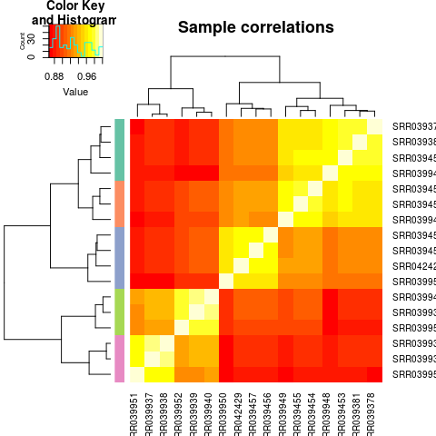
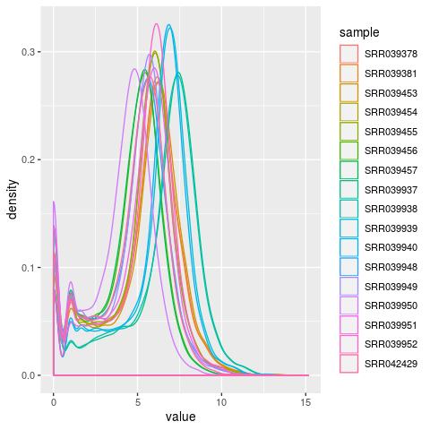
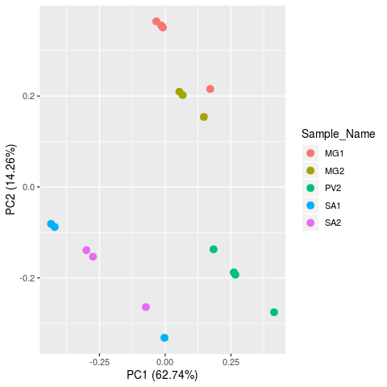
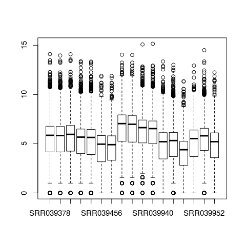

```{r setup, include=FALSE}
library("knitr")
opts_chunk$set(echo = TRUE,
               fig.pos = 'h',
               fig.align = 'center',
               fig.show='hold')

```
## Introduction
This document contains the workflow used in the analysis of *T. brucei* gene co-expression network analysis. It contains code used in each step of the analysis.

## Data acquisition
Data used in this study is obtained from European Nucleotide Archive under accession number SRP002243.

First, metadata for the data is obtained from EBI as follows:

```{r echo=TRUE, results='hide', eval=FALSE}
#Obtain metadata information for the data used in this study from ENA and SRA databases.

# ENA metadata
# code adapted from: https://wiki.bits.vib.be/index.php/Download_read_information_and_FASTQ_data_from_the_SRA
accession <- "SRP002243"
ena.url <- paste("http://www.ebi.ac.uk/ena/data/warehouse/filereport?accession=",
                 accession,
                 "&result=read_run",
                 "&fields=run_accession,library_name,",
                 "read_count,fastq_ftp,fastq_aspera,",
                 "fastq_galaxy,sra_ftp,sra_aspera,sra_galaxy,",
                 "&download=text",
                 sep="")
ENA.metadata <- read.table(url(ena.url), header=TRUE, sep="\t")

# SRA metadata
SRA.metadata <- read.table("../data/SraRunTable.metadata.txt", header = TRUE, sep = "\t")

# obtain sample metadata to be used later in analysis.
matches <- c("Run","Library_Name","Sample_Name")
sample.metadata <- SRA.metadata[grepl(paste(matches, collapse="|"), names(SRA.metadata))]

# create grouping factor that will place each sample in the one of three tissues i.e.
# midgut (MG), proventriculus(PV) and salivary glands (SG)
tissue <- factor(c("MG", "MG", "MG", "MG", "MG", "PV", "PV", "SG", "SG", "SG", "SG", "MG", "MG", "PV", "SG", "SG", "PV"))

# append factor to sample.metadata to group samples
sample.metadata["Tissue"] <- tissue

# create a text file with urls to fastq files in ENA database
fastq.urls <- ENA.metadata[grepl("fastq_ftp", names(ENA.metadata))]
write.csv(fastq.urls, file="../data/fastq.urls.txt", eol = "\r\n", quote = FALSE, row.names = FALSE)
```
```{r, eval=FALSE, echo=TRUE}
# print out the sample metadata table
kable(sample.metadata)
```


Next, RNASeq data is downloaded from EBI database's FTP site.

```{bash}
cat ../scripts/fastq_download.sh
```

Some of the downstream tools require that FASTQ files downloaded in zipped form are unzipped.

```{bash}
cat ../scripts/unzip.sh
```

## Data quality assessment
After downloading the RNASeq data, its quality is checked through the FASTQC tool whose output is a report in HTML format.

```{bash}
cat ../scripts/fastqc_reports.sh
```

Following the high rate of unaligned and duplicate reads, further analysis is done to ascertain their cause. The reads are aligned to *Glossina morsitans* genome to determine whether reads from the vector were also present in the sample during sequencing. Duplicate reads are assessed whether they are artifacts from PCR (PCR duplicates).

## Downloading *T. brucei* and *G. morsitans* genome and annotation files

The genome and annotation files are downloaded from the TriTrypDB and vectorbase databases as follows:

```{bash}
#Downloading T. brucei genome

#wget https://tritrypdb.org/common/downloads/release-43/TbruceiTREU927/fasta/data/TriTrypDB-43_TbruceiTREU927_Genome.fasta -P ../data/tbrucei_genome/

#Downloading the GFF file
#wget https://tritrypdb.org/common/downloads/release-43/TbruceiTREU927/gff/data/TriTrypDB-43_TbruceiTREU927.gff -P ../data/tbrucei_genome_annotations_GFF/

# Downloading Glossina genome
#wget https://www.vectorbase.org/download/glossina-morsitans-yalescaffoldsgmory1fagz -P ../data/glossina_genome_scaffolds/

# Downloading GTF file
#wget https://www.vectorbase.org/download/glossina-morsitans-yalebasefeaturesgmory19gff3gz -P ../data/glossina_annonations_GTF/

```

Next, *T. brucei* and *G. morsitans* genome files are concatenated into a single fasta file which is used during the alignment of the reads.

```{bash}
# make a directory to store the concatenated genomes
# mkdir -P ../data/brucei-morsitans

# move the genomes to the created directory and concatenate them
# cat ../data/brucei-morsitans/*.fa* > ../data/brucei-morsitans/brucei-morsitans_genomes.fasta
```


## Alignment of reads on the genome

Here, HISAT2 is used to align reads on the *T. brucei* and *G. morsitans* genomes. The first step is indexing the genome using HISAT2 followed by alignment of the reads. The output is SAM files.

### Indexing the genome

```{bash}
cat ../scripts/hisat2_index.sh
```

### Aligning the reads to the genome

```{bash}
cat ../scripts/hisat2_align.sh
```

## Assessment of the duplication rate
At this point, quality control to assess the duplication rate can be performed.
First, the SAM files are converted to sorted BAM files required by dupRadar tool.

```{bash}
cat ../scripts/sam-to-bam.sh
```

The BAM files are then sorted using samtools

```{bash}
cat ../scripts/sam-to-bam.sh
```

Next, duplicates are marked in the BAM files using Picard.

```{bash}
cat ../scripts/mark_dupes.sh
```

At this point, dupRadar tool is used to perform quality control in R.

```{r eval=FALSE}
library(dupRadar)
library(Rsubread)

# Parameters
bam_file <- "../data/processed_data/bru-mor_bam/SRR039378.dupMarked.bam"
gtf_file <- "../data/brucei-morsitans/brucei-morsitans_annotations.gtf"
stranded <- 0
paired <- FALSE
Threads <- 8

# Duplication rate ananlysis
dm <- analyzeDuprates(bam_file, gtf_file, stranded, paired, Threads)

#Plots
png(filename = "../figures/duplicate_rate_SRR039378.png")
par(mfrow=c(1,2))
duprateExpDensPlot(DupMat=dm)
title("SRR039378")
dev.off()

# Boxplot
duprateExpBoxplot(DupMat=dm)
```


## Reads quantification

HTSeq tool is used to count reads that aligned to the *T. brucei* genome. The output is a text file for each sample that contains the number of reads that were counted for each gene.

```{bash}
cat ../scripts/htseq_counts.sh
```

## Generating MultiQC report

MultiQC aggregates results from FASTQC, HISAT2 and HTSeq analysis into an HTML formatted single report for better visualization.

```{bash}
#change directory to results
cd ../results

#Run multiqc
#multiqc .
```


## Analysis in R

### Setting up R for the analysis

```{r results='hide', eval=FALSE}
# Ensure results are reproducible
set.seed(1)

# Other settings
options(digits = 4)

# Loading required R packages
library("limma")
library("edgeR")
library("RColorBrewer")
library("ggplot2")
library("gplots")
library("reshape2")
library("ggfortify")
```

### Importing samples count data into R

For further analysis, samples read counts are read into R. To read the sample counta data into R using the script below, simply type `source("../scripts/htseq-combine_all.R")` on the R console and hit enter.

```{bash}
cat ../scripts/htseq-combine_all.R
```

### Sample quality check

The quality of the samples is checked before further analysis to check for outlier and batch effects.

```{r eval=FALSE}
# Create a DGEList object
counts <- DGEList(data.all, group = sample.metadata$Tissue)

# filter out Non-expressed genes and those with low expression values.
# keep genes with at least 1 read per million in n samples, where n is minimum number of replicates which is 3 in this case

keep <- rowSums(cpm(counts)>1) >= 3

# retain genes above the cpm value
filtered.counts <- counts[keep, , keep.lib.sizes=FALSE]

# Normalize for composition bias using TMM
filtered.counts <- calcNormFactors(filtered.counts, method = 'TMM')

# get logcpm normalized counts
logcpm.norm.counts <- cpm(filtered.counts, log = TRUE, prior.count = 2, normalized.lib.sizes = TRUE)

```

Various plots are made for the samples before and after filtering the low-expressed genes and non-expressed genes.

**Samples heatmap**
```{r results='hide', eval=FALSE}
sample_category <- nlevels(sample.metadata$Sample_Name)
colour.palette <- colorRampPalette(brewer.pal(sample_category, "Set2"))(sample_category)
sample.colours <- colour.palette[as.integer(sample.metadata$Sample_Name)]

# Raw counts data (before filtering)
# png(filename = "../figures/raw_sample_heatmap.png", res = 90, type = "cairo")

# heatmap.2(cor(data.all), RowSideColors=sample.colours, trace='none', main='Sample correlations')

# Filtered counts data
png(filename = "../figures/norm.filt_sample_heatmap.png", res = 90, type = "cairo")

heatmap.2(cor(logcpm.norm.counts), RowSideColors=sample.colours, trace='none', main='Sample correlations')

dev.off()
```
```{r fig.cap="Filtered sample heatmap", eval=FALSE}


```

\newpage
 **Samples density plot**
```{r eval=FALSE, results='hide'}
# Checking further using sample density plot
# raw data
#log.counts <- log2(data.all + 1)
#png("../figures/raw_sample_density.png", res = 90, type = "cairo")

# filtered data
#log.counts <- log2(filtered.data.all + 1)
png("../figures/norm.filt_sample_density.png", res = 90, type = "cairo")

x <- melt(as.matrix(logcpm.norm.counts))
colnames(x) <- c('gene_id', 'sample', 'value')
ggplot(x, aes(x=value, color=sample)) + geom_density()

dev.off()
```
```{r fig.cap="Filtered sample heatmap", eval=FALSE}


```

\newpage
 **Principal component analysis**
```{r eval=FALSE, results='hide'}
# PCA
pca.log.counts <- prcomp(t(logcpm.norm.counts))

#png(filename = "../figures/raw_samples_PCA.png", res = 90, type = "cairo")
png(filename = "../figures/norm.filt_sample_PCA.png", res = 90, type = "cairo")
autoplot(pca.log.counts,
         data = sample.metadata,
         colour="Sample_Name",
         size=3)
dev.off()
```
```{r fig.cap="Filtered sample heatmap", eval=FALSE}


```

\newpage
 **Boxplot**
```{r, eval=FALSE}
png(filename = "../figures/norm.filt_sample_boxplot.png", res =90, type = "cairo")
boxplot(logcpm.norm.counts)
dev.off()
```
```{r fig.cap="Filtered sample boxplot", eval=FALSE}


``` 

\newpage
 **Mean-Difference plots (MD plots)**
```{r}

```
\newpage 
### Identify differentially expressed genes

```{r eval=FALSE}
# Apply sample grouping based on Tissue from which the sample was derived
design <- model.matrix(~0+sample.metadata$Tissue)
colnames(design) <- levels(sample.metadata$Tissue)

# Estimate dispersions for tags
filtered.counts <- estimateDisp(filtered.counts, design)

# Fit a generalized likelihood model to the DGELIST using sample grouping
fit <- glmFit(filtered.counts,design)

#################################################################
# code in this section adapted from https://github.com/iscb-dc-rsg/2016-summer-workshop
# generate a list of all possible pairwise contrasts
condition_pairs <- t(combn(levels(sample.metadata$Tissue), 2))

comparisons <- list()
for (i in 1:nrow(condition_pairs)) {
  comparisons[[i]] <- as.character(condition_pairs[i,])
}

# vector to store differentially expressed genes
sig_genes <- c()

# iterate over the contrasts, and perform a differential expression test for
# each pair
for (conds in comparisons) {
    # generate string contrast formula
    contrast_formula <- paste(conds, collapse=' - ')

    contrast_mat <- makeContrasts(contrasts=contrast_formula, levels=design)
    contrast_lrt <- glmLRT(fit, contrast=contrast_mat)
    topGenes <- topTags(contrast_lrt, n=Inf, p.value=0.005)
    
    # Grab highly ranked genes
    sig_genes <- union(sig_genes, rownames(topGenes$table))
}

# Filter out genes which were not differentially expressed for any contrast
de.genes <- filtered.counts[rownames(filtered.counts) %in% sig_genes,]
################################################################

# Likelihood ratio test to identify DEGs
#lrt <- glmLRT(fit,coef = 2)

# Genes with most significant differences
#topTags(lrt)
#topGenes <- topTags(lrt, n=Inf)

# DE genes at 5% FDR
#de.genes <- decideTestsDGE(lrt, adjust.method = "BH", p.value = 0.05)
```


