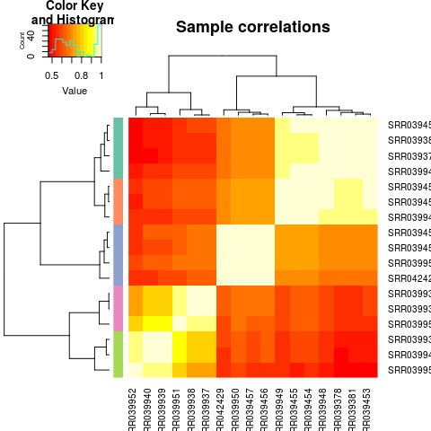

```{r setup, include=FALSE}
knitr::opts_chunk$set(echo = TRUE)
```
## Introduction
This document contains the workflow used in the analysis of *T. brucei* gene co-expression network analysis. It contains code used in each step of the analysis.

## Data acquisition
Data used in this study is obtained from European Nucleotide Archive under accession number SRP002243.

First, metadata for the data is obtained from EBI as follows:

```{r echo=TRUE, results='hide', eval=FALSE}
#Obtain metadata information for the data used in this study from ENA and SRA databases.

# ENA metadata
# code adapted from: https://wiki.bits.vib.be/index.php/Download_read_information_and_FASTQ_data_from_the_SRA
accession <- "SRP002243"
ena.url <- paste("http://www.ebi.ac.uk/ena/data/warehouse/filereport?accession=",
                 accession,
                 "&result=read_run",
                 "&fields=run_accession,library_name,",
                 "read_count,fastq_ftp,fastq_aspera,",
                 "fastq_galaxy,sra_ftp,sra_aspera,sra_galaxy,",
                 "&download=text",
                 sep="")
ENA.metadata <- read.table(url(ena.url), header=TRUE, sep="\t")

# SRA metadata
SRA.metadata <- read.table("../data/SraRunTable.metadata.txt", header = TRUE, sep = "\t")

# Obtain sample metadata to be used later in analysis.
matches <- c("Run","Library_Name","Sample_Name")
sample.metadata <- SRA.metadata[grepl(paste(matches, collapse="|"), names(SRA.metadata))]

# create a text file with urls to fastq files in ENA database
fastq.urls <- ENA.metadata[grepl("fastq_ftp", names(ENA.metadata))]
write.csv(fastq.urls, file="../data/fastq.urls.txt", eol = "\r\n", quote = FALSE, row.names = FALSE)

```


Next, RNASeq data is downloaded from EBI database's FTP site.

```{bash}
cat ../scripts/fastq_download.sh
```

Some of the downstream tools require that FASTQ files downloaded in zipped form are unzipped.

```{bash}
cat ../scripts/unzip.sh
```

## Data quality assessment
After downloading the RNASeq data, its quality is checked through the FASTQC tool whose output is a report in HTML format.

```{bash}
cat ../scripts/fastqc_reports.sh
```

## Downloading *T. brucei* genome and GFF files

After determining that the data is of good quality and that no trimming is required, the reads are aligned on the *T. brucei* genome obtained from TriTrypDB database.

The genome and the Gene Feature Format (GFF) files are downloaded from the TriTrypDB database as follows:

```{bash}
#Downloading the genome

#wget https://tritrypdb.org/common/downloads/release-42/TbruceiTREU927/fasta/data/\
#TriTrypDB-42_TbruceiTREU927_Genome.fasta -P ../data/tbrucei_genome/


#Downloading the GFF file
#wget https://tritrypdb.org/common/downloads/release-42/TbruceiTREU927/gff/data/\
#TriTrypDB-42_TbruceiTREU927.gff -P ../data/genome_annotations_GFF/
```

## Alignment of reads on the genome

Here, HISAT2 is used to align reads on the *T. brucei* genome. The first step is indexing the genome using HISAT2 followed by alignment of the reads. The output is SAM files.

### Indexing the genome

```{bash}
cat ../scripts/hisat2_index.sh
```

### Aligning the reads to the genome

```{bash}
cat ../scripts/hisat2_align.sh
```

## Reads quantification

HTSeq tool is used to count reads that aligned to the *T. brucei* genome. The output is a text file for each sample that contains the number of reads that were counted for each gene.

```{bash}
cat ../scripts/htseq_counts.sh
```

## Generating MultiQC report

MultiQC aggregates results from FASTQC, HISAT2 and HTSeq analysis into an HTML formatted single report for better visualization.

```{bash}
#change directory to results
cd ../results

#Run multiqc
#multiqc .
```


## Analysis in R

### Setting up R for the analysis

```{r message=TRUE}
# Ensure results are reproducible
set.seed(1)

# Loading required R packages
library("limma")
library("edgeR")
library("RColorBrewer")
library("ggplot2")
library("gplots")
library("reshape2")
library("ggfortify")
```

### Importing samples count data into R

For further analysis, samples read counts are read into R.

```{bash}
cat ../scripts/htseq-combine_all.R
```

### Sample quality check

The quality of the samples is checked before further analysis to check for outlier and batch effects.

```{r results='hide', eval=FALSE, echo=TRUE}
sample_category <- nlevels(sample.metadata$Sample_Name)
colour.palette <- colorRampPalette(brewer.pal(sample_category, "Set2"))(sample_category)
sample.colours <- colour.palette[as.integer(sample.metadata$Sample_Name)]

png(filename = "../figures/raw_sample_heatmap.png", res = 90)

heatmap.2(cor(data.all), RowSideColors=sample.colours, trace='none', main='Sample correlations')

dev.off()
```



Checking further...

```{r echo=TRUE, eval=FALSE, results='hide'}
log.counts <- log2(data.all + 1)

png("../figures/raw_sample_density.png", res = 90)

x <- melt(as.matrix(log.counts))
colnames(x) <- c('gene_id', 'sample', 'value')
ggplot(x, aes(x=value, color=sample)) + geom_density()

dev.off()
```


**Principle Component Analysis (PCA)**

```{r eval=FALSE, results='hide'}
# PCA
pca.log.counts <- prcomp(t(log.counts))

png(filename = "../figures/raw_samples_PCA.png", res = 90)
autoplot(pca.log.counts,
         data = sample.metadata,
         colour="Sample_Name",
         size=3)
dev.off()
```


### Filter out low-expressed and Non-expressed genes


